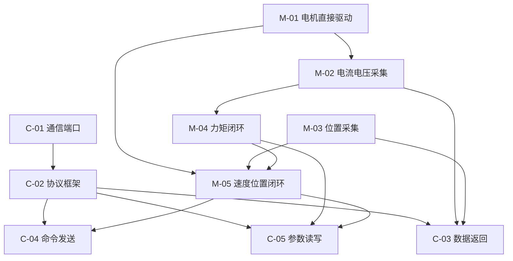

# 飞特 STS3215c018 舵机
> **产品：** 飞特 STS3215c018 舵机  
**板卡型号：** 16999-PS26040802  
**工程路径：** `servo_project/`  
**编写日期：** 2026-06-24 · **最近更新：** 2026-07-02 · 文档版本：v3.3-语雀
>

[TOC]

---

## 1. 项目概述
飞特 STS3215c018 是一款带位置反馈的舵机，内部采用 **GD32F130** 主控 + **AS5600** 磁编码器 + **EG2104 H 桥** 驱动有刷电机。本文档包含：

1. **硬件分析** — 器件清单、引脚对应、系统框图  
2. **功能实现需求** — 电机类与通信类任务清单  
3. **任务总表与详情** — 可跟踪状态、跳转、验收的开发任务

---

## 2. 硬件分析
### 2.1 原理图说明
> 原理图文件（本地）：[16999-PS26040802 原理图.pdf](https://wit-motion.yuque.com/attachments/yuque/0/2026/pdf/66811243/1782285566780-0d6c46a2-8e75-4304-92a8-3d1749b8e58b.pdf)  

>

```latex
  P1/P2(VIN) ──► 保护/滤波 ──► VCC ──► ME6119 LDO ──► 3V3 ──► GD32 + AS5600 + 运放
                    │                                        │
                    └──────────────► VC1 ──► EG2104×2 ──► H桥 ──► M+ / M-
                                                              │
                                                         RS1(0.01Ω) ──► GS8591 ──► PA3 ADC
```

### 2.2 主要器件
| 器件 | 型号 | 功能 | 资料 |
| --- | --- | --- | --- |
| MCU | **GD32F130F8P6TR** | 主控，TSSOP-20，64KB Flash | [GD32F130xx Datasheet Rev4.2.pdf](https://wit-motion.yuque.com/attachments/yuque/0/2026/pdf/66811243/1782285630083-86cfb78d-f806-4ad0-9e0a-53bf63c2ffc1.pdf)<br/>[GD32F1x0_用户手册_Rev4.0.pdf](https://wit-motion.yuque.com/attachments/yuque/0/2026/pdf/66811243/1782285639722-40575784-fd61-422e-bb26-4f401437e45d.pdf) |
| 位置传感器 | **AS5600-ASOM** | 12-bit 磁旋转位置传感器，I2C 地址 0x36 | [C79815_位置传感器_AS5600-ASOM_规格书_WJ105942.PDF](https://wit-motion.yuque.com/attachments/yuque/0/2026/pdf/66811243/1782285672159-1cfe6e6e-b458-4969-8923-1003c0b36180.pdf) |
| 栅极驱动 | **EG2104 × 2** | 半桥栅极驱动，组成 H 桥 | [C186697_栅极驱动芯片_EG2104_规格书_WJ01420.PDF](https://wit-motion.yuque.com/attachments/yuque/0/2026/pdf/66811243/1782285686408-030fc569-7a1b-40fc-bf68-d73fa31e6a7b.pdf) |
| 运放 | **GS8591-TR** | 电流采样差分放大 | [C157718_精密运放_GS8591-TR_规格书_WJ348829.PDF](https://wit-motion.yuque.com/attachments/yuque/0/2026/pdf/66811243/1782285702245-a617fba2-166b-4550-992e-3ad63909d7ce.pdf) |
| 稳压 | **ME6119C33M5G** | 3.3V LDO | [C81100_线性稳压器(LDO)_ME6119C33M5G_规格书_WJ209545.PDF](https://wit-motion.yuque.com/attachments/yuque/0/2026/pdf/66811243/1782285713835-d166f370-8411-46ce-a076-1821aef54d21.pdf) |
| 功率管 | B3202 × 2 | N 管半桥功率模块 |  |
| 采样电阻 | RS1 0.01Ω | 低端电流 shunt，约 1A → 10mV |  |


### 2.3 引脚功能对应表
| 器件 | MCU 引脚 | 连接对象 | 功能 / 复用 |
| --- | --- | --- | --- |
| GD32F130F8P6TR | PA1 | — | ADC_IN1 |
| GD32F130F8P6TR | PA2 | 串口 TX/RX | **USART1** TX/RX（单线半双工，AF1；固件见 `bap_uart.h`） |
| GD32F130F8P6TR | PA3 | GS8591-TR OUT | 电流采样 ADC_IN3 |
| GD32F130F8P6TR | PA4 | VIN 分压网络 | 母线电压 ADC_IN4 |
| GD32F130F8P6TR | PA6 | EG2104 #SD | H 桥驱动使能（低电平关断） |
| GD32F130F8P6TR | PA7 | M+ 侧 EG2104 IN | TIMER2_CH1，正转 PWM |
| GD32F130F8P6TR | PA9 | AS5600 SCL | I2C1_SCL |
| GD32F130F8P6TR | PA10 | AS5600 SDA | I2C1_SDA |
| GD32F130F8P6TR | PA13 | 烧录器 SWDIO | SWD 调试 |
| GD32F130F8P6TR | PA14 | 烧录器 SWCLK | SWD 调试 |
| GD32F130F8P6TR | PB1 | M- 侧 EG2104 IN | TIMER2_CH3，反转 PWM |
| GD32F130F8P6TR | PF0 | 烧录器 SWDIO | SWDIO（与 PA13 同功能，按实际 PCB 走线确认） |
| GD32F130F8P6TR | BOOT0 | GND | 从 Flash 启动 |
| GD32F130F8P6TR | NRST | 复位/调试座 | 系统复位 |


**EG2104 驱动要点：**

| 动作 | 做法 |
| --- | --- |
| 正转 | PA7 输出 PWM，PB1 低 |
| 反转 | PB1 输出 PWM，PA7 低 |
| 关断 | PA6 #SD 拉低 |
| 使能 | PA6 #SD 拉高 |


**AS5600 要点：** I2C 400 kHz；角度寄存器 0x0E（12-bit，0~4095）；STATUS 0x0B bit5（MD）= 磁铁有效；DIR 接 GND → 顺时针角度增大。

---

## 3. 功能实现需求
### 3.1 需求清单
**电机类**

| 需求 | 任务编号 | 说明 |
| --- | --- | --- |
| 电机直接驱动 | M-01 | PA7/PB1 PWM + PA6 #SD，开环正反转 |
| 电流及母线电压数据采集 | M-02 | PA3 电流、PA4 母线电压 ADC |
| 位置传感器数据采集 | M-03 | PA9/PA10 I2C 读 AS5600 |
| 电机力矩闭环 | M-04 | 电流环 PI，输出 PWM |
| 电机速度位置闭环 | M-05 | 位置/速度环 + 模式管理 |


**通信类**

| 需求 | 任务编号 | 说明 |
| --- | --- | --- |
| 通信端口打通 | C-01 | PA2 半双工串口 |
| 通信协议框架 | C-02 | 帧格式、CRC、命令分发 |
| 电机数据返回 | C-03 | 状态上报（角度/电流/电压等） |
| 电机命令发送 | C-04 | 运动指令、急停 |
| 电机参数读取写入 | C-05 | PID、保护阈值在线调整 |


### 3.2 目标控制架构
```latex
位置环(PD) → 速度环(PI) → H 桥 PWM (PA7/PB1) + #SD (PA6)    ← 当前已实现（P3 双环）
位置环 → 速度环 → 电流(力矩)环 → H 桥 PWM                  ← 目标（P4 三环）
         ↑              ↑
      AS5600          GS8591/PA3
```

**当前固件（2026-07-02）：** `motor.c` 位置模式为「轨迹规划 `angle_control_plan` + 精调区位置 PD → `plan_speed` → 速度 PI → duty」；力矩模式为开环 duty，电流环 PI 尚未接入。

---

## 4. 使用说明
### 如何更新任务状态
在 **§5 任务总表** 中，直接修改对应行的「状态」列。可选值见下表，**仅使用这五种**，便于筛选与统计。

| 状态 | 含义 |
| --- | --- |
| 未开始 | 尚未着手 |
| 准备中 | 方案/环境/依赖已就绪，即将开发 |
| 推进中 | 正在实现或联调 |
| 已完成 | 验收通过 |
| 优化中 | 功能可用，持续改进性能或鲁棒性 |


### 如何添加新任务
1. 在 **§5 任务总表** 新增一行（大类 / 任务 / 子任务 三选一填「层级」列）。
2. 编号规则：电机类 `M-xx` / `M-xx-y`；通信类 `C-xx` / `C-xx-y`。
3. 在 **§6 任务详情** 对应分类下，复制 **附录 A** 模板粘贴并填写。
4. **标题即锚点**：详情标题 `#### M-XX 任务名称` → 总表链接 `名称`（空格改 `-`）；语雀中输入 `` 可自动补全。
5. 子任务标题用 `##### M-XX-Y 名称`，放在父任务「子任务明细」小节下，总表同步加一行。
6. 更新 **§8 依赖关系** 与 **§9 推荐实施计划**（如有影响）。


### 4.2 语雀里如何跳转到某个任务（重要）
语雀 **不能跳到某一行**，只能跳到 **某个标题块**。手写 `[链接](#M-01-xxx)` 在导入后 **无效**，点击可能新开页面。

**推荐方式（无需手改链接）：**

1. 阅读时打开文档右侧 **「大纲」** 面板，点击 `M-02-1 ADC 时钟与 GPIO 初始化` 等标题即可跳转。
2. 文首 `[TOC]` 会生成可点击目录（部分语雀版本支持）。

**若要在总表里做可点击跳转（导入后操作一次）：**

1. 在 **阅读模式** 下，鼠标悬停目标标题左侧，点击 **#** 图标，复制锚点（形如 `#abcde`）。
2. 回到编辑模式，选中总表中的任务名 → **插入链接** → 粘贴该锚点。
3. 或：选中文字 → 插入链接 → **选择当前文档的标题**（语雀自动匹配，最省事）。

**编号即定位：** 总表「编号」列（如 `M-02-1`）与详情区标题一致，可用 `Ctrl+F` 搜索编号快速定位。

### 文档结构
```latex
§1 项目概述        ← 产品说明
§2 硬件分析        ← 器件、引脚、框图
§3 功能实现需求    ← 需求清单与架构
§4 使用说明        ← 状态更新、添加任务
§5 任务总表        ← 大/小/子任务 + 状态 + 跳转
§6 任务详情        ← 目标、思路、代码、验收
§7~§11 架构与计划  ← 参考信息
附录 A/B           ← 模板与修订记录
```

---

## 5. 任务总表
> **快速跳转：** 请使用语雀右侧 **大纲面板**，或文首 `[TOC]` 目录（详见 §4.2）
>

| 层级 | 编号 | 任务名称 | 阶段 | 状态 |
| :---: | --- | --- | :---: | :---: |
| 大类 | M | 电机类 | — | — |
| 任务 | M-01 | 电机直接驱动 | P0 | 已完成 |
| 子任务 | M-01-1 | 引脚与 BSP 分层（bsp_pwm / bsp_gpio） | P0 | 已完成 |
| 子任务 | M-01-2 | 确认 PB1 定时器复用与 PWM 初始化 | P0 | 已完成 |
| 子任务 | M-01-3 | 实现 motor_init() | P0 | 已完成 |
| 子任务 | M-01-4 | 实现 motor_enable/disable | P0 | 已完成 |
| 子任务 | M-01-5 | 实现 motor_set_duty() | P0 | 已完成 |
| 子任务 | M-01-6 | 默认关断 + 加入 Keil 工程编译 | P0 | 已完成 |
| 任务 | M-02 | 电流及母线电压数据采集 | P1 | 推进中 |
| 子任务 | M-02-1 | ADC 时钟与 GPIO 初始化 | P1 | 已完成 |
| 子任务 | M-02-2 | ADC 校准与通道配置 | P1 | 已完成 |
| 子任务 | M-02-3 | 定时采样或 DMA 扫描 | P1 | 已完成 |
| 子任务 | M-02-4 | 电流换算公式实现 | P1 | 已完成 |
| 子任务 | M-02-5 | 母线电压换算公式实现 | P1 | 已完成 |
| 子任务 | M-02-6 | 软件滤波 | P1 | 未开始 |
| 子任务 | M-02-7 | 过流/欠压/过压保护与关断 | P1 | 未开始 |
| 任务 | M-03 | 位置传感器数据采集 | P1 | 优化中 |
| 子任务 | M-03-1 | I2C1 初始化 | P1 | 已完成 |
| 子任务 | M-03-2 | 读 STATUS 判断磁铁有效 | P1 | 已完成 |
| 子任务 | M-03-3 | 读 ANGLE 12-bit 角度 | P1 | 已完成 |
| 子任务 | M-03-4 | 角度 unwrap 处理跳变 | P1 | 已完成 |
| 子任务 | M-03-5 | 差分计算速度 | P1 | 已完成 |
| 子任务 | M-03-6 | 无磁铁安全处理 | P1 | 未开始 |
| 任务 | M-04 | 电机力矩闭环（电流环） | P4 | 未开始 |
| 子任务 | M-04-1 | 定义 i_target 接口 | P4 | 未开始 |
| 子任务 | M-04-2 | 实现电流 PI 控制器 | P4 | 未开始 |
| 子任务 | M-04-3 | 输出限幅与积分抗饱和 | P4 | 未开始 |
| 子任务 | M-04-4 | 控制周期与 ADC 同步 | P4 | 未开始 |
| 子任务 | M-04-5 | 与过流保护、#SD 联动 | P4 | 未开始 |
| 子任务 | M-04-6 | 力矩模式上层接口 | P4 | 推进中 |
| 任务 | M-05 | 电机速度位置闭环 | P3/P4 | 推进中 |
| 子任务 | M-05-1 | 角度误差计算（wrap） | P3 | 已完成 |
| 子任务 | M-05-2 | 位置 PID → plan_speed | P3 | 已完成 |
| 子任务 | M-05-3 | AS5600 差分得 speed_meas | P4 | 已完成 |
| 子任务 | M-05-4 | 速度 PID → duty | P4 | 已完成 |
| 子任务 | M-05-5 | 模式管理（开环/力矩/速度/位置） | P3 | 已完成 |
| 子任务 | M-05-6 | 到位判定与堵转检测 | P4 | 未开始 |
| 子任务 | M-05-7 | 通信设置目标值接口 | P5 | 未开始 |
| 大类 | C | 通信类 | — | — |
| 任务 | C-01 | 通信端口打通 | P2 | 推进中 |
| 子任务 | C-01-1 | PA2 配置 USART1 AF 复用 | P2 | 已完成 |
| 子任务 | C-01-2 | 使能半双工模式 | P2 | 已完成 |
| 子任务 | C-01-3 | GPIO 开漏 + 外部上拉 | P2 | 已完成 |
| 子任务 | C-01-4 | 波特率 1 Mbps 8N1 配置 | P2 | 已完成 |
| 子任务 | C-01-5 | 字节收发与环形缓冲 | P2 | 推进中 |
| 子任务 | C-01-6 | 半双工时序与总线冲突避免 | P2 | 推进中 |
| 任务 | C-02 | 通信协议框架（STS） | P2 | 未开始 |
| 子任务 | C-02-1 | 定义帧结构与命令枚举 | P2 | 未开始 |
| 子任务 | C-02-2 | 组帧、解帧、Checksum 校验 | P2 | 未开始 |
| 子任务 | C-02-3 | 命令分发 proto_dispatch() | P2 | 未开始 |
| 子任务 | C-02-4 | 错误码定义 | P2 | 未开始 |
| 任务 | C-03 | 电机数据返回 | P5 | 推进中 |
| 子任务 | C-03-1 | 定义 motor_status_t 结构体 | P5 | 未开始 |
| 子任务 | C-03-2 | 控制环周期内更新快照 | P5 | 未开始 |
| 子任务 | C-03-3 | READ → 状态应答 | P5 | 未开始 |
| 子任务 | C-03-4 | 可选定时主动上报 | P5 | 未开始 |
| 子任务 | C-03-5 | JustFloat 调试波形（VOFA+） | P5 | 已完成 |
| 任务 | C-04 | 电机命令发送 | P5 | 未开始 |
| 子任务 | C-04-1 | 解析 WRITE 帧 | P5 | 未开始 |
| 子任务 | C-04-2 | 参数范围校验 | P5 | 未开始 |
| 子任务 | C-04-3 | 写入命令队列/共享目标变量 | P5 | 未开始 |
| 子任务 | C-04-4 | 控制环固定周期读取执行 | P5 | 未开始 |
| 子任务 | C-04-5 | 非法命令返回 ERROR | P5 | 未开始 |
| 任务 | C-05 | 电机参数读取写入 | P5 | 未开始 |
| 子任务 | C-05-1 | RAM 参数表与默认值 | P5 | 未开始 |
| 子任务 | C-05-2 | GET_PARAM / SET_PARAM 实现 | P5 | 未开始 |
| 子任务 | C-05-3 | 范围检查与即时生效 | P5 | 未开始 |
| 子任务 | C-05-4 | 可选 Flash 持久化 SAVE_PARAM | P5 | 未开始 |
| 子任务 | C-05-5 | 与 PID / 保护模块绑定 | P5 | 未开始 |


**阶段说明：**

| 阶段 | 名称 | 里程碑 |
| --- | --- | --- |
| P0 | 基础驱动 | 电机可开环正反转 |
| P1 | 感知采集 | 电流、电压、角度可读 |
| P2 | 通信基础 | 串口双向通信 + 最小协议 |
| P3 | 单环伺服 | 位置环跟踪 |
| P4 | 完整伺服 | 电流环 + 速度环 |
| P5 | 产品化 | 完整通信、保护、参数管理 |


↑ 返回总表

---

## 6. 任务详情
### 电机类
---

#### M-01 电机直接驱动
| 字段 | 内容 |
| --- | --- |
| **任务目标** | 不依赖闭环，按占空比/方向直接驱动 H 桥，实现开环正反转与关断 |
| **实现思路** | 按 §2.3：PA7=TIMER2_CH1、PB1=TIMER2_CH3、PA6=#SD；PWM 约 20 kHz（`MOTOR_PWM_PERIOD=3599`）；正转 PA7 PWM/PB1 低，反转相反 |
| **代码实现跳转** | `servo_project/User/bsp/bsp_pwm.c`、`servo_project/User/bsp/bsp_gpio.c`、`servo_project/User/servo/motor.c`、`servo_project/User/servo/motor.h` |
| **遇到问题** | 例程引脚与原理图不一致；已改为 BSP 分层而非 `board_config.h` |
| **方案改进** | PWM 放在 `bsp_pwm.c`，应用层 `motor_set_duty()` 负责正反转逻辑 |
| **验收标准** | 给定固定 duty 可正转/反转/停止；#SD 拉低时 H 桥无输出；PWM 约 20 kHz，无异常发热 |
| **完成情况** | **已完成** — 已集成 Keil 工程，`motor_init()` 在 `Init.c` 调用 |


**依赖：** 无（最底层，优先实施） · **硬件：** PA7→U2 IN；PB1→U3 IN；PA6→#SD

#### 子任务明细
##### M-01-1 引脚与 BSP 分层
| 字段 | 内容 |
| --- | --- |
| 任务目标 | 引脚与原理图 §2.3 一致 |
| 实现思路 | `bsp_pwm.c` 配置 PA7/PB1 AF1 TIMER2；`bsp_gpio.c` 配置 PA6 #SD |
| 代码实现 | `servo_project/User/bsp/bsp_pwm.c`、`servo_project/User/bsp/bsp_gpio.c` |
| 遇到问题 | — |
| 方案改进 | 未单独建 `board_config.h`，引脚集中在 BSP |
| 验收标准 | 与硬件说明一一对应 |
| 完成情况 | 已完成 |


##### M-01-2 确认 PB1 定时器复用与 PWM 初始化
| 字段 | 内容 |
| --- | --- |
| 任务目标 | 确定 PB1 的 TIMER 通道并完成 PWM 时基配置 |
| 实现思路 | 查数据手册 AF 表 → 选 TIMER → 配置 PSC/ARR 得 20 kHz |
| 代码实现 | `servo_project/User/bsp/bsp_pwm.c` |
| 遇到问题 | PB1 复用关系未确认 |
| 方案改进 | — |
| 验收标准 | 示波器测 PB1/P A7 波形频率约 20 kHz |
| 完成情况 | 已完成 — PB1=TIMER2_CH3、PA7=TIMER2_CH1，AF1 |


##### M-01-3 实现 motor_init()
| 字段 | 内容 |
| --- | --- |
| 任务目标 | 初始化 PWM 与 #SD GPIO |
| 实现思路 | RCU 时钟 → GPIO AF → TIMER PWM 模式 → 默认占空比 0 |
| 代码实现 | `servo_project/User/servo/motor.c` |
| 遇到问题 | — |
| 方案改进 | `motor_init()` 同时初始化速度/位置 PID 默认参数 |
| 验收标准 | 初始化后两路 PWM 无输出、#SD 使能 |
| 完成情况 | 已完成 |


##### M-01-4 实现 motor_enable() / motor_disable()
| 字段 | 内容 |
| --- | --- |
| 任务目标 | 通过 #SD 控制 H 桥使能/关断 |
| 实现思路 | #SD 高电平使能，低电平关断；disable 时同步清零 PWM |
| 代码实现 | `servo_project/User/servo/motor.c` |
| 遇到问题 | — |
| 方案改进 | — |
| 验收标准 | enable 后可输出 PWM；disable 后 H 桥无驱动 |
| 完成情况 | 已完成 |


##### M-01-5 实现 motor_set_duty()
| 字段 | 内容 |
| --- | --- |
| 任务目标 | 按符号设置正反转占空比 |
| 实现思路 | duty>0：PA7 PWM + PB1 低；duty<0：PB1 PWM + PA7 低；duty=0：全低 |
| 代码实现 | `servo_project/User/servo/motor.c`、`servo_project/User/bsp/bsp_pwm.c` |
| 遇到问题 | — |
| 方案改进 | — |
| 验收标准 | 正负 duty 对应正反转，幅值与占空比一致 |
| 完成情况 | 已完成 |


##### M-01-6 默认关断 + 加入 Keil 工程编译
| 字段 | 内容 |
| --- | --- |
| 任务目标 | 模块集成进 `servo_project` 且编译无错 |
| 实现思路 | 在 `template.uvprojx` 添加源文件；`main.c` 调用 `motor_init()` |
| 代码实现 | `servo_project/User/main.c`、`servo_project/project/template.uvprojx` |
| 遇到问题 | — |
| 方案改进 | — |
| 验收标准 | Keil 编译通过；上电电机不转 |
| 完成情况 | 已完成 |


↑ 总表 M-01

---

#### M-02 电流及母线电压数据采集
| 字段 | 内容 |
| --- | --- |
| **任务目标** | 周期性采样母线电流与 VIN 电压，供保护与闭环使用 |
| **实现思路** | PA3/PA4 ADC 双通道扫描；TIMER2 TRGO 触发 + DMA 环形缓冲；`electricity_update()` 换算物理量 |
| **代码实现跳转** | `servo_project/User/bsp/bsp_adc.c`、`servo_project/User/bsp/bsp_dma.c`、`servo_project/User/servo/electricity.c`、`servo_project/User/servo/electricity.h` |
| **遇到问题** | 电流增益 `ADC_CURRENT_GAIN`、分压系数仍为估算值，未做万用表/钳形表标定 |
| **方案改进** | 后续补软件滤波（M-02-6）与保护关断（M-02-7） |
| **验收标准** | 稳定读取 `i_bus(A)`、`v_bus(V)`；VIN 与万用表误差可接受；过流可关断驱动 |
| **完成情况** | **推进中** — DMA 采样与换算已实现；滤波与保护未做 |


**依赖：** 建议 M-01 完成后联调 · **硬件：** PA3←电流采样；PA4←VIN 分压

#### 子任务明细
##### M-02-1 ADC 时钟与 GPIO 初始化
| 字段 | 内容 |
| --- | --- |
| 任务目标 | PA3/PA4 模拟输入就绪 |
| 实现思路 | 使能 ADC/GPIO 时钟，配置为 analog 模式 |
| 代码实现 | `servo_project/User/bsp/bsp_adc.c` |
| 遇到问题 | — |
| 方案改进 | — |
| 验收标准 | ADC 可读到原始值 |
| 完成情况 | 已完成 |


##### M-02-2 ADC 校准与通道配置
| 字段 | 内容 |
| --- | --- |
| 任务目标 | CH3 电流、CH4 电压通道配置完成 |
| 实现思路 | 上电校准 → 规则组 2 通道 → 采样时间满足运放建立 |
| 代码实现 | `servo_project/User/bsp/bsp_adc.c` |
| 遇到问题 | — |
| 方案改进 | — |
| 验收标准 | 双通道交替采样正常 |
| 完成情况 | 已完成 |


##### M-02-3 定时采样或 DMA 扫描
| 字段 | 内容 |
| --- | --- |
| 任务目标 | 1~10 kHz 稳定采样 |
| 实现思路 | TIMER 触发 ADC + DMA 环形缓冲 |
| 代码实现 | `servo_project/User/bsp/bsp_adc.c`、`servo_project/User/bsp/bsp_dma.c` |
| 遇到问题 | — |
| 方案改进 | TIMER2 UPDATE 触发 ADC，与 PWM 周期同步 |
| 验收标准 | 采样率稳定，CPU 占用可接受 |
| 完成情况 | 已完成 |


##### M-02-4 电流换算公式实现
| 字段 | 内容 |
| --- | --- |
| 任务目标 | ADC → 母线电流（A） |
| 实现思路 | `I = (V_adc - V_offset) / (G × 0.01)`，G 标定 |
| 代码实现 | `servo_project/User/servo/electricity.c` |
| 遇到问题 | G 为配置估算值 |
| 方案改进 | 见 M-02 方案改进 |
| 验收标准 | 与钳形表趋势一致 |
| 完成情况 | 已完成（待标定） |


##### M-02-5 母线电压换算公式实现
| 字段 | 内容 |
| --- | --- |
| 任务目标 | ADC → VIN（V） |
| 实现思路 | `VIN = adc_raw × 3.3 / 4096 × K_div` |
| 代码实现 | `servo_project/User/servo/electricity.c` |
| 遇到问题 | 分压比 `11.5/1.5` 为估算 |
| 方案改进 | 见 M-02 方案改进 |
| 验收标准 | 与万用表误差 <5% |
| 完成情况 | 已完成（待标定） |


##### M-02-6 软件滤波
| 字段 | 内容 |
| --- | --- |
| 任务目标 | 降低采样噪声 |
| 实现思路 | 滑动平均或一阶低通 |
| 代码实现 | `servo_project/User/servo/electricity.c`（待扩展） |
| 遇到问题 | — |
| 方案改进 | — |
| 验收标准 | 静态读数稳定，动态响应可接受 |
| 完成情况 | 未开始 |


##### M-02-7 过流/欠压/过压保护与关断
| 字段 | 内容 |
| --- | --- |
| 任务目标 | 异常时自动 `motor_disable()` |
| 实现思路 | 阈值比较 + 故障标志位 + 可选迟滞 |
| 代码实现 | `servo_project/User/servo/electricity.c`（待扩展） |
| 遇到问题 | — |
| 方案改进 | — |
| 验收标准 | 模拟过流/欠压可关断并置 fault |
| 完成情况 | 未开始 |


↑ 总表 M-02

---

#### M-03 位置传感器数据采集
| 字段 | 内容 |
| --- | --- |
| **任务目标** | 读取 AS5600 绝对角度，检测磁铁，计算速度 |
| **实现思路** | I2C1（PA9/PA10）连读 STATUS+ANGLE；`speed.c` 做 unwrap 与速度观测；100 Hz 编码器更新 |
| **代码实现跳转** | `servo_project/User/bsp/bap_i2c.c`、`servo_project/User/servo/encoder.c`、`servo_project/User/servo/speed.c`、`servo_project/User/servo/servo_config.h` |
| **遇到问题** | I2C 偶发 fail_stage 需实机排查；无磁铁时仅返回 0，未联动关断 |
| **方案改进** | `bap_i2c.c` 含总线恢复；后续补 M-03-6 安全处理 |
| **验收标准** | 角度连续；无磁可检测；速度平滑方向正确 |
| **完成情况** | **优化中** — 读角/unwrap/速度观测已工作；无磁铁保护未做 |


**依赖：** 无（可与 M-02 并行） · **硬件：** PA9/PA10 I2C1 → AS5600（0x36）

#### 子任务明细
##### M-03-1 I2C1 初始化
| 字段 | 内容 |
| --- | --- |
| 任务目标 | I2C1 400 kHz 就绪 |
| 实现思路 | PA9 SCL、PA10 SDA，AF4，开漏上拉 |
| 代码实现 | `servo_project/User/bsp/bap_i2c.c` |
| 遇到问题 | — |
| 方案改进 | — |
| 验收标准 | 可读写 AS5600 寄存器 |
| 完成情况 | 已完成 |


##### M-03-2 读 STATUS 判断磁铁有效
| 字段 | 内容 |
| --- | --- |
| 任务目标 | 检测 MD 位 |
| 实现思路 | 读 0x0B，检查 bit[5] |
| 代码实现 | `servo_project/User/servo/encoder.c` |
| 遇到问题 | — |
| 方案改进 | 与 ANGLE 一次 I2C 事务连读 |
| 验收标准 | 有/无磁铁状态正确 |
| 完成情况 | 已完成 |


##### M-03-3 读 ANGLE 12-bit 角度
| 字段 | 内容 |
| --- | --- |
| 任务目标 | 读 0x0E 得 0~4095 |
| 实现思路 | 读 2 字节，取低 12 bit |
| 代码实现 | `servo_project/User/servo/encoder.c` |
| 遇到问题 | — |
| 方案改进 | — |
| 验收标准 | 旋转时 raw 单调（除跳变点） |
| 完成情况 | 已完成 |


##### M-03-4 角度 unwrap 处理跳变
| 字段 | 内容 |
| --- | --- |
| 任务目标 | 多圈累计角度 |
| 实现思路 | `speed.c` 中 `angle_degree_diff_limit()` + `turn_count` 累圈 |
| 代码实现 | `servo_project/User/servo/speed.c` |
| 遇到问题 | — |
| 方案改进 | — |
| 验收标准 | 连续旋转角度单调递增/递减 |
| 完成情况 | 已完成 |


##### M-03-5 差分计算速度
| 字段 | 内容 |
| --- | --- |
| 任务目标 | 估算角速度 |
| 实现思路 | `speed_update()` 差分多圈角 / Δt，500 Hz |
| 代码实现 | `servo_project/User/servo/speed.c` |
| 遇到问题 | — |
| 方案改进 | — |
| 验收标准 | 匀速时 speed 稳定，方向正确 |
| 完成情况 | 已完成 |


##### M-03-6 无磁铁安全处理
| 字段 | 内容 |
| --- | --- |
| 任务目标 | 无磁铁时不允许闭环 |
| 实现思路 | `magnet_ok==false` 时 disable + 置 fault |
| 代码实现 | `servo_project/User/servo/motor.c`（待扩展） |
| 遇到问题 | — |
| 方案改进 | — |
| 验收标准 | 移走磁铁后电机关断 |
| 完成情况 | 未开始 |


↑ 总表 M-03

---

#### M-04 电机力矩闭环（电流环）
| 字段 | 内容 |
| --- | --- |
| **任务目标** | 给定目标电流/力矩，PI 调节 PWM 占空比 |
| **实现思路** | 电流环最内环：PI 输出 duty；与 ADC 采样同步；积分抗饱和；与过流保护联动 |
| **代码实现跳转** | 目标：`servo_project/User/servo/pid.c`（通用 PID 已有） · 电流环模块待建 |
| **遇到问题** | 当前力矩模式为开环 `target_duty`，未接电流 PI |
| **方案改进** | 先完成 M-02 标定与保护，再接入 M-04 |
| **验收标准** | 固定 i_target 稳态误差可接受；超限关断；可独立力矩模式 |
| **完成情况** | **未开始** — M-04-6 力矩开环接口已在 `motor.c` 中占位 |


**依赖：** M-01、M-02

#### 子任务明细
##### M-04-1 定义 i_target 接口
| 字段 | 内容 |
| --- | --- |
| 任务目标 | 统一力矩给定入口 |
| 实现思路 | float A 或归一化 -1.0~1.0 |
| 代码实现 | `servo_project/User/current_loop.h`（待建） |
| 遇到问题 | — |
| 方案改进 | — |
| 验收标准 | 接口文档清晰，可设目标 |
| 完成情况 | 未开始 |


##### M-04-2 实现电流 PI 控制器
| 字段 | 内容 |
| --- | --- |
| 任务目标 | error = i_target - i_meas → PI → duty |
| 实现思路 | 复用通用 `pid.c` 或独立 PI |
| 代码实现 | `servo_project/User/current_loop.c`（待建） |
| 遇到问题 | — |
| 方案改进 | — |
| 验收标准 | 阶跃响应收敛 |
| 完成情况 | 未开始 |


##### M-04-3 输出限幅与积分抗饱和
| 字段 | 内容 |
| --- | --- |
| 任务目标 | 防止积分 windup |
| 实现思路 | duty 限 ±max_duty；饱和时停积分 |
| 代码实现 | `servo_project/User/current_loop.c`（待建） |
| 遇到问题 | — |
| 方案改进 | — |
| 验收标准 | 大误差时不振荡发散 |
| 完成情况 | 未开始 |


##### M-04-4 控制周期与 ADC 同步
| 字段 | 内容 |
| --- | --- |
| 任务目标 | 环周期与采样对齐 |
| 实现思路 | ADC 完成中断或 DMA 半满触发 PI |
| 代码实现 | `servo_project/User/current_loop.c`（待建） |
| 遇到问题 | — |
| 方案改进 | — |
| 验收标准 | 周期抖动 <10% |
| 完成情况 | 未开始 |


##### M-04-5 与过流保护、#SD 联动
| 字段 | 内容 |
| --- | --- |
| 任务目标 | 故障时立即退出闭环 |
| 实现思路 | 读 fault_flags → disable + 清积分 |
| 代码实现 | `servo_project/User/current_loop.c`（待建） |
| 遇到问题 | — |
| 方案改进 | — |
| 验收标准 | 过流后 PI 状态复位 |
| 完成情况 | 未开始 |


##### M-04-6 力矩模式上层接口
| 字段 | 内容 |
| --- | --- |
| 任务目标 | 供 M-05 / C-04 调用 |
| 实现思路 | `motor_control_mode_torque` → `motor_set_duty(target_duty)` |
| 代码实现 | `servo_project/User/servo/motor.c` |
| 遇到问题 | 无电流闭环，仅为开环占空比 |
| 方案改进 | 接入 M-04 电流 PI 后替换 |
| 验收标准 | 模式切换正确 |
| 完成情况 | 推进中（开环占位） |


↑ 总表 M-04

---

#### M-05 电机速度位置闭环
| 字段 | 内容 |
| --- | --- |
| **任务目标** | 位置/速度伺服，给定目标后稳定跟踪 |
| **实现思路** | **当前 P3 双环：** 粗定位 `angle_control_plan`（v_stop 加减速）→ 精调区位置 PD → `plan_speed` → 速度 PI → duty；带 1° 死区 + 0.5° 滞回；`motor_test` Watch 在线调参 |
| **代码实现跳转** | `servo_project/User/servo/motor.c`、`servo_project/User/servo/pid.c`、`servo_project/User/servo/motor_test.c`、`servo_project/User/servo/servo_config.h`、`servo_project/User/servo/time.c` |
| **遇到问题** | 精调区边界曾抖动；位置 I 与速度 I 重复；实机精度 ±0.5° 目标待整参 |
| **方案改进** | 位置环 Ki=0，持力交给速度环 PI；停止区用 PD 精调而非 PWM=0 硬停 |
| **验收标准** | 位置阶跃到位超调可接受；速度模式平稳；模式切换无冲击 |
| **完成情况** | **推进中** — 双环架构与轨迹规划已联调；堵转检测与通信接口未做 |


**依赖：** M-01、M-03（P3）；+ M-04（P4 完整三环）

#### 子任务明细
##### M-05-1 角度误差计算（wrap）
| 字段 | 内容 |
| --- | --- |
| 任务目标 | 多圈绝对角误差（最短路径） |
| 实现思路 | `target_angle - motor_angle_multi_degree`，基于 unwrap 多圈角 |
| 代码实现 | `servo_project/User/servo/motor.c` |
| 遇到问题 | — |
| 方案改进 | — |
| 验收标准 | 跨 0° 时走最短路径 |
| 完成情况 | 已完成 |


##### M-05-2 位置 PID → plan_speed
| 字段 | 内容 |
| --- | --- |
| 任务目标 | 外环位置控制 |
| 实现思路 | 粗定位：`angle_control_plan`；精调区：`location_pid`（PD，Ki=0）→ `plan_speed` |
| 代码实现 | `servo_project/User/servo/motor.c`、`servo_project/User/servo/pid.c` |
| 遇到问题 | 曾仅在死区内更新 PID 导致 error 恒 0 |
| 方案改进 | 精调区持续运行 PD；参数见 `servo_config.h` |
| 验收标准 | 位置阶跃响应合格 |
| 完成情况 | 已完成（待整参） |


##### M-05-3 AS5600 差分得 speed_meas
| 字段 | 内容 |
| --- | --- |
| 任务目标 | 速度反馈 |
| 实现思路 | 复用 M-03-5 `speed_update()` |
| 代码实现 | `servo_project/User/servo/speed.c` |
| 遇到问题 | — |
| 方案改进 | — |
| 验收标准 | 与 M-03 速度一致 |
| 完成情况 | 已完成 |


##### M-05-4 速度 PID → duty
| 字段 | 内容 |
| --- | --- |
| 任务目标 | 中环速度 PID |
| 实现思路 | `speed_pid`（PI，Kp=10 Ki=0.5）→ `motor_set_duty()`；500 Hz |
| 代码实现 | `servo_project/User/servo/motor.c`、`servo_project/User/servo/pid.c` |
| 遇到问题 | — |
| 方案改进 | 速度环积分承担带载持力 |
| 验收标准 | 速度模式平稳 |
| 完成情况 | 已完成（待整参） |


##### M-05-5 模式管理
| 字段 | 内容 |
| --- | --- |
| 任务目标 | 开环/力矩/速度/位置切换 |
| 实现思路 | `motor_control_mode_t` + `motor_test_poll()` 在线切换 |
| 代码实现 | `servo_project/User/servo/motor.c`、`servo_project/User/servo/motor_test.c` |
| 遇到问题 | — |
| 方案改进 | — |
| 验收标准 | 切换无异常冲击 |
| 完成情况 | 已完成 |


##### M-05-6 到位判定与堵转检测
| 字段 | 内容 |
| --- | --- |
| 任务目标 | 判定到位与堵转保护 |
| 实现思路 | 到位：|error|<阈值持续 N ms；堵转：速度低且电流高 |
| 代码实现 | `servo_project/User/servo/motor.c`（待扩展） |
| 遇到问题 | — |
| 方案改进 | — |
| 验收标准 | 堵转时关断并报警 |
| 完成情况 | 未开始 |


##### M-05-7 通信设置目标值接口
| 字段 | 内容 |
| --- | --- |
| 任务目标 | 供 C-04 写入目标 |
| 实现思路 | STS WRITE 映射到 `motor_context.control` |
| 代码实现 | 待 C-02/C-04 实现后对接 `motor.c` |
| 遇到问题 | — |
| 方案改进 | 当前仅 `motor_test` / Watch 可改 setpoint |
| 验收标准 | 上位机改目标后环跟踪 |
| 完成情况 | 未开始 |


↑ 总表 M-05

---

### 通信类
**物理层：** PA2 → **USART1** 单线半双工 1 Mbps → P1 Pin1 + GND（见 `bap_uart.h`）

---

#### C-01 通信端口打通
| 字段 | 内容 |
| --- | --- |
| **任务目标** | 建立 MCU 与上位机串口链路 |
| **实现思路** | PA2 配置 USART1 半双工；开漏+上拉；**1 Mbps** 8N1；TX DMA + RX 环形缓冲；`uart_comm_rx_enable()` 待协议阶段开启 |
| **代码实现跳转** | `servo_project/User/bsp/bap_uart.c`、`servo_project/User/bsp/bap_uart.h`、`servo_project/User/servo/uart.c`、`servo_project/User/servo/uart.h` |
| **遇到问题** | 当前为 JustFloat 调试仅 TX，RBNE 中断未在 init 中开启（避免半双工自收） |
| **方案改进** | 实现 STS 协议时调用 `uart_comm_rx_enable()` |
| **验收标准** | 双向收发无误；长时间通信丢包率可接受 |
| **完成情况** | **推进中** — TX DMA 与 RX 环形缓冲代码已有；接收未启用 |


**依赖：** 无（可与 P0/P1 并行）

#### 子任务明细
##### C-01-1 PA2 配置 USART1 AF 复用
| 字段 | 内容 |
| --- | --- |
| 任务目标 | PA2 为 USART1 半双工复用 |
| 实现思路 | GPIO AF1，见 `bap_uart.h` |
| 代码实现 | `servo_project/User/bsp/bap_uart.c` |
| 遇到问题 | — |
| 方案改进 | — |
| 验收标准 | 引脚波形正确 |
| 完成情况 | 已完成 |


##### C-01-2 使能半双工模式
| 字段 | 内容 |
| --- | --- |
| 任务目标 | 单线收发 |
| 实现思路 | `usart_halfduplex_enable()` |
| 代码实现 | `servo_project/User/bsp/bap_uart.c` |
| 遇到问题 | — |
| 方案改进 | — |
| 验收标准 | 单线可收发 |
| 完成情况 | 已完成 |


##### C-01-3 GPIO 开漏 + 外部上拉
| 字段 | 内容 |
| --- | --- |
| 任务目标 | 总线物理层正确 |
| 实现思路 | OD 输出 + 4.7k 上拉 |
| 代码实现 | `servo_project/User/bsp/bap_uart.c` |
| 遇到问题 | — |
| 方案改进 | — |
| 验收标准 | 空闲高电平 |
| 完成情况 | 已完成 |


##### C-01-4 波特率 1 Mbps 8N1 配置
| 字段 | 内容 |
| --- | --- |
| 任务目标 | 通信参数就绪（STS 协议 1 Mbps） |
| 实现思路 | `COMM_BAUDRATE = 1000000U` |
| 代码实现 | `servo_project/User/bsp/bap_uart.h` |
| 遇到问题 | — |
| 方案改进 | — |
| 验收标准 | 波特率误差 <2% |
| 完成情况 | 已完成 |


##### C-01-5 字节收发与环形缓冲
| 字段 | 内容 |
| --- | --- |
| 任务目标 | 中断驱动收发 |
| 实现思路 | RX ring buffer + `USART1_IRQHandler`；TX DMA |
| 代码实现 | `servo_project/User/servo/uart.c`、`servo_project/User/bsp/bap_uart.c` |
| 遇到问题 | init 中未调用 `uart_comm_rx_enable()` |
| 方案改进 | STS 协议落地时开启 RX |
| 验收标准 | 连续收发不丢字节 |
| 完成情况 | 推进中 |


##### C-01-6 半双工时序与总线冲突避免
| 字段 | 内容 |
| --- | --- |
| 任务目标 | 发完再收 |
| 实现思路 | TX DMA 完成后再收；`uart_comm_poll()` 组帧 |
| 代码实现 | `servo_project/User/servo/uart.c` |
| 遇到问题 | poll 当前为空 |
| 方案改进 | — |
| 验收标准 | 无总线冲突 garble |
| 完成情况 | 推进中 |


↑ 总表 C-01

---

#### C-02 通信协议框架（STS）
| 字段 | 内容 |
| --- | --- |
| **任务目标** | 实现飞特 STS 自定义通信协议，支撑 PING/READ/WRITE |
| **实现思路** | 帧头 `0xFF 0xFF` + ID + Length + Instruction + Parameters + Checksum；`Check Sum = ~(ID+Length+Instruction+Parameters) & 0xFF`；在 `uart_comm_poll()` 组帧解帧 |
| **代码实现跳转** | 目标：`servo_project/User/servo/uart.c`（poll 入口）、协议模块待建 · 参考：`docs/舵机STS自定义通信协议.docx` |
| **遇到问题** | — |
| **方案改进** | 先落地 PING(0x01)、READ(0x02)、WRITE(0x03) 三类指令 |
| **验收标准** | 合法帧正确应答；非法帧返回 ERROR 状态字节 |
| **完成情况** | **未开始** — 下一步工作（2026-07-03 计划） |


**STS 指令（首批）：** 0x01 PING · 0x02 READ · 0x03 WRITE · 应答含 ERROR 状态字节

**依赖：** C-01（需开启 RX）

#### 子任务明细
##### C-02-1 定义帧结构与命令枚举
| 字段 | 内容 |
| --- | --- |
| 任务目标 | 协议数据结构 |
| 实现思路 | struct + enum cmd |
| 代码实现 | `servo_project/User/proto.h`（待建） |
| 遇到问题 | — |
| 方案改进 | — |
| 验收标准 | 头文件可独立 include |
| 完成情况 | 未开始 |


##### C-02-2 组帧、解帧、Checksum 校验
| 字段 | 内容 |
| --- | --- |
| 任务目标 | 编解码与校验 |
| 实现思路 | STS 累加和取反低 8 位 |
| 代码实现 | 待建（`uart_comm_poll` 或独立 `sts_proto.c`） |
| 遇到问题 | — |
| 方案改进 | — |
| 验收标准 | 与协议文档示例帧一致 |
| 完成情况 | 未开始 |


##### C-02-3 命令分发 proto_dispatch()
| 字段 | 内容 |
| --- | --- |
| 任务目标 | 按命令码路由 |
| 实现思路 | switch/case 或函数表 |
| 代码实现 | `servo_project/User/proto.c`（待建） |
| 遇到问题 | — |
| 方案改进 | — |
| 验收标准 | 各命令码可路由 |
| 完成情况 | 未开始 |


##### C-02-4 错误码定义
| 字段 | 内容 |
| --- | --- |
| 任务目标 | 统一错误语义 |
| 实现思路 | 校验失败/越界/未使能等 |
| 代码实现 | `servo_project/User/proto.h`（待建） |
| 遇到问题 | — |
| 方案改进 | — |
| 验收标准 | NACK 带错误码 |
| 完成情况 | 未开始 |


↑ 总表 C-02

---

#### C-03 电机数据返回
| 字段 | 内容 |
| --- | --- |
| **任务目标** | 周期性或按需上报电机运行状态 |
| **实现思路** | STS READ 应答控制表；调试阶段 JustFloat DMA 经 VOFA+ 观测 |
| **代码实现跳转** | `servo_project/User/servo/data_send.c`、`servo_project/User/main.c`（JF_SEND 宏） |
| **遇到问题** | STS 状态快照结构体尚未定义 |
| **方案改进** | JustFloat 仅用于开发调试，产品化走 STS READ |
| **验收标准** | 上位机数据与本地一致；fault 位正确 |
| **完成情况** | **推进中** — JustFloat 调试通道已完成 |


**上报字段：** angle_raw · speed · i_bus · v_bus · duty · mode · fault_flags · magnet_ok

**依赖：** C-01、C-02、M-02、M-03

#### 子任务明细
##### C-03-1 定义 motor_status_t 结构体
| 字段 | 内容 |
| --- | --- |
| 任务目标 | 统一状态快照 |
| 实现思路 | packed struct 与协议对齐 |
| 代码实现 | `servo_project/User/proto.h`（待建） |
| 遇到问题 | — |
| 方案改进 | — |
| 验收标准 | sizeof 与协议一致 |
| 完成情况 | 未开始 |


##### C-03-2 控制环周期内更新快照
| 字段 | 内容 |
| --- | --- |
| 任务目标 | 数据实时性 |
| 实现思路 | 环末尾 memcpy 到 status |
| 代码实现 | `servo_project/User/servo_ctrl.c`（待建） |
| 遇到问题 | — |
| 方案改进 | — |
| 验收标准 | 快照与当前值一致 |
| 完成情况 | 未开始 |


##### C-03-3 GET_STATUS → STATUS_REPORT
| 字段 | 内容 |
| --- | --- |
| 任务目标 | 按需查询 |
| 实现思路 | dispatch 0x01 → 组 0x02 帧 |
| 代码实现 | `servo_project/User/proto.c`（待建） |
| 遇到问题 | — |
| 方案改进 | — |
| 验收标准 | 上位机查询有正确回复 |
| 完成情况 | 未开始 |


##### C-03-4 可选定时主动上报
| 字段 | 内容 |
| --- | --- |
| 任务目标 | 周期性推送 |
| 实现思路 | SysTick 或 TIMER 按 report_period_ms |
| 代码实现 | `servo_project/User/proto.c`（待建） |
| 遇到问题 | — |
| 方案改进 | — |
| 验收标准 | 频率可配置 |
| 完成情况 | 未开始 |


##### C-03-5 JustFloat 调试波形（VOFA+）
| 字段 | 内容 |
| --- | --- |
| 任务目标 | 开发阶段实时波形观测 |
| 实现思路 | DMA 发送 float 通道 + JustFloat 尾标记；`main.c` 中 JF_SEND 5 通道 |
| 代码实现 | `servo_project/User/servo/data_send.c`、`servo_project/User/main.c` |
| 遇到问题 | 与 STS 半双工共用 USART1，调试时仅 TX |
| 方案改进 | — |
| 验收标准 | VOFA+ 可显示角度/速度/plan_speed/target 等 |
| 完成情况 | 已完成 |


↑ 总表 C-03

---

#### C-04 电机命令发送
| 字段 | 内容 |
| --- | --- |
| **任务目标** | 上位机下发运动与模式指令 |
| **实现思路** | 解析 SET_TARGET：使能/目标位置/速度/电流/开环 duty/急停；校验范围；写入共享目标；环内执行 |
| **代码实现跳转** | 目标：`servo_project/User/proto.c`（待建）、`servo_project/User/servo_ctrl.c`（待建） |
| **遇到问题** | — |
| **方案改进** | — |
| **验收标准** | 位置指令跟踪；急停立即关断；越界拒绝 |
| **完成情况** | 未开始 |


**依赖：** C-01、C-02、M-01、M-05

#### 子任务明细
##### C-04-1 解析 SET_TARGET 帧
| 字段 | 内容 |
| --- | --- |
| 任务目标 | 解包运动命令 |
| 实现思路 | 按 mode 解析 payload |
| 代码实现 | `servo_project/User/proto.c`（待建） |
| 遇到问题 | — |
| 方案改进 | — |
| 验收标准 | 各 mode 解析正确 |
| 完成情况 | 未开始 |


##### C-04-2 参数范围校验
| 字段 | 内容 |
| --- | --- |
| 任务目标 | 拒绝非法值 |
| 实现思路 | 角度/duty/电流上下限 |
| 代码实现 | `servo_project/User/proto.c`（待建） |
| 遇到问题 | — |
| 方案改进 | — |
| 验收标准 | 越界返回 NACK |
| 完成情况 | 未开始 |


##### C-04-3 写入命令队列/共享目标变量
| 字段 | 内容 |
| --- | --- |
| 任务目标 | 线程安全传递 |
| 实现思路 | volatile 目标 + 新命令标志 |
| 代码实现 | `servo_project/User/servo_ctrl.c`（待建） |
| 遇到问题 | — |
| 方案改进 | — |
| 验收标准 | 命令不丢失 |
| 完成情况 | 未开始 |


##### C-04-4 控制环固定周期读取执行
| 字段 | 内容 |
| --- | --- |
| 任务目标 | 环内应用命令 |
| 实现思路 | 每周期检查 cmd_pending |
| 代码实现 | `servo_project/User/servo_ctrl.c`（待建） |
| 遇到问题 | — |
| 方案改进 | — |
| 验收标准 | 延迟 ≤1 控制周期 |
| 完成情况 | 未开始 |


##### C-04-5 非法命令返回 NACK
| 字段 | 内容 |
| --- | --- |
| 任务目标 | 错误反馈 |
| 实现思路 | 0xFF + err_code |
| 代码实现 | `servo_project/User/proto.c`（待建） |
| 遇到问题 | — |
| 方案改进 | — |
| 验收标准 | 非法帧有 NACK |
| 完成情况 | 未开始 |


↑ 总表 C-04

---

#### C-05 电机参数读取写入
| 字段 | 内容 |
| --- | --- |
| **任务目标** | 在线调整 PID、限幅、保护阈值等 |
| **实现思路** | RAM 参数表 + GET/SET_PARAM；范围检查即时生效；可选 Flash SAVE_PARAM |
| **代码实现跳转** | 目标：`servo_project/User/param.c`（待建）、`servo_project/User/param.h`（待建） |
| **遇到问题** | — |
| **方案改进** | — |
| **验收标准** | 读写一致；改 PID 有效果；Flash 重启保留（若实现） |
| **完成情况** | 未开始 |


**参数 ID：** 0x01 位置 PID · 0x02 速度 PID · 0x03 电流 PI · 0x10 max_duty · 0x11 i_max · 0x12 v_min/v_max · 0x20 report_period_ms

**依赖：** C-01、C-02；被调 M-04、M-05

#### 子任务明细
##### C-05-1 RAM 参数表与默认值
| 字段 | 内容 |
| --- | --- |
| 任务目标 | 参数存储 |
| 实现思路 | struct + 默认数组 |
| 代码实现 | `servo_project/User/param.c`（待建） |
| 遇到问题 | — |
| 方案改进 | — |
| 验收标准 | 上电默认值合理 |
| 完成情况 | 未开始 |


##### C-05-2 GET_PARAM / SET_PARAM 实现
| 字段 | 内容 |
| --- | --- |
| 任务目标 | 协议读写 |
| 实现思路 | 按 param_id 读写 |
| 代码实现 | `servo_project/User/param.c`（待建） |
| 遇到问题 | — |
| 方案改进 | — |
| 验收标准 | 读回与写入一致 |
| 完成情况 | 未开始 |


##### C-05-3 范围检查与即时生效
| 字段 | 内容 |
| --- | --- |
| 任务目标 | 安全写入 |
| 实现思路 | clamp + 同步到 PID 结构 |
| 代码实现 | `servo_project/User/param.c`（待建） |
| 遇到问题 | — |
| 方案改进 | — |
| 验收标准 | 越界拒绝；合法立即生效 |
| 完成情况 | 未开始 |


##### C-05-4 可选 Flash 持久化 SAVE_PARAM
| 字段 | 内容 |
| --- | --- |
| 任务目标 | 掉电保存 |
| 实现思路 | Flash 末尾页擦写 |
| 代码实现 | `servo_project/User/param.c`（待建） |
| 遇到问题 | — |
| 方案改进 | — |
| 验收标准 | 重启参数保留 |
| 完成情况 | 未开始 |


##### C-05-5 与 PID / 保护模块绑定
| 字段 | 内容 |
| --- | --- |
| 任务目标 | 参数驱动控制 |
| 实现思路 | setter 更新 pid/protect 结构 |
| 代码实现 | `servo_project/User/param.c`（待建） |
| 遇到问题 | — |
| 方案改进 | — |
| 验收标准 | 改 kp 后响应变化 |
| 完成情况 | 未开始 |


↑ 总表 C-05

---

## 7. 总体架构
```latex
┌─────────────────────────────────────────────────────────┐
│  通信层（PA2 单线半双工 USART1 @ 1 Mbps）                  │
│  STS 协议（待实现）│ JustFloat 调试 TX（已实现）            │
└──────────────────────────┬──────────────────────────────┘
                           │
┌──────────────────────────▼──────────────────────────────┐
│  应用层：motor_test + 模式管理（力矩/速度/位置）           │
└──────────────────────────┬──────────────────────────────┘
                           │
        ┌──────────────────┼──────────────────┐
        ▼                  ▼                  ▼
   位置环 PD           速度环 PI          电流环 PI
   + 轨迹规划              │              （未实现）
        │                  │                  │
        └──────────────────┴──────────────────┘
                           ▼
                    PWM 输出 + #SD 使能
                           │
        ┌──────────────────┼──────────────────┐
        ▼                  ▼                  ▼
     AS5600              ADC PA3            ADC PA4
     (I2C 100Hz)         电流 DMA          母线电压 DMA
```

**当前控制环（2026-07-02）：** 位置 250 Hz · 速度 500 Hz · ADC 与 PWM 同步 · 力矩模式开环 duty

**目标控制环：** 位置环 → 速度环 → 电流(力矩)环 → H 桥 PWM

---

## 8. 依赖关系


---

## 9. 当前工程状态（2026-07-02）

| 任务 | 状态 | 说明 |
| --- | --- | --- |
| M-01 | 已完成 | `bsp_pwm` + `motor.c`，Keil 编译通过 |
| M-02 | 推进中 | TIMER2 触发 ADC+DMA，`electricity.c` 换算；缺滤波与保护 |
| M-03 | 优化中 | `encoder.c` + `speed.c` 读角/unwrap/速度；缺无磁铁关断 |
| M-04 | 未开始 | 力矩模式为开环 duty |
| M-05 | 推进中 | 双环 PD+PI + `angle_control_plan` + `motor_test`；待整参与堵转检测 |
| C-01 | 推进中 | USART1 1Mbps 半双工 TX DMA；RX 缓冲已有但未 enable |
| C-02 | 未开始 | STS 协议（下一步） |
| C-03 | 推进中 | JustFloat 调试 TX 可用 |
| C-04~C-05 | 未开始 | 依赖 C-02 |

**主循环结构（`main.c`）：** ADC 标志 → `electricity_update()` · 编码器 100Hz → `encoder_update()` / `speed_update()` · `uart_comm_poll()` · `motor_test_poll()` · `motor_control()` · JustFloat DMA

**控制参数（`servo_config.h` / `time.h`）：**

| 参数 | 值 |
| --- | --- |
| 位置环 | 250 Hz，PD（Ki=0），Kp=5 Kd=0.05 |
| 速度环 | 500 Hz，PI Kp=10 Ki=0.5 |
| 精调死区 | 1° + 0.5° 滞回 |
| 轨迹规划 | `POS_TRIM_SPEED_MAX=60°/s`，v_stop 加减速 |

**已知待办：**

1. **C-02 STS 协议**：`uart_comm_rx_enable()` + `uart_comm_poll()` 组帧，PING/READ/WRITE
2. **M-05 实机整参**：带载精度与抖动验收
3. **M-02 标定**：电流增益、VIN 分压比；补 M-02-6/7 滤波与保护
4. **M-03-6**：无磁铁时 `motor_disable()` + fault
5. **M-04**：电流环 PI 接入（P4 三环）

---

## 附录 A · 任务详情模板（复制用）
```markdown
#### X-XX 任务名称

| 字段 | 内容 |
|------|------|
| **任务目标** | |
| **实现思路** | |
| **代码实现跳转** | `servo_project/User/文件.c` |
| **遇到问题** | — |
| **方案改进** | — |
| **验收标准** | |
| **完成情况** | 未开始 |

#### 子任务明细

##### X-XX-1 子任务名称

| 字段 | 内容 |
|------|------|
| 任务目标 | |
| 实现思路 | |
| 代码实现 | |
| 遇到问题 | — |
| 方案改进 | — |
| 验收标准 | |
| 完成情况 | 未开始 |


```

**总表新增行模板：**

```markdown
| 任务 | X-XX | 任务名称 | P? | 未开始 |
| 子任务 | X-XX-1 | 子任务名称 | P? | 未开始 |
```

---

## 附录 B · 修订记录
| 日期 | 版本 | 说明 |
| --- | --- | --- |
| 2026-06-23 | v1.0 | 初版，由功能需求拆解整理 |
| 2026-06-24 | v2.0 | 重构：任务总表（大/小/子任务+状态+跳转）、统一详情模板、附录模板 |
| 2026-06-24 | v2.0-语雀 | 语雀适配：去 HTML 锚点、代码路径改行内代码、[TOC]、标题锚点跳转 |
| 2026-06-24 | v3.0-语雀 | 整合飞特 STS3215c018 硬件分析、引脚表、功能需求与任务拆解 |
| 2026-06-24 | v3.1-语雀 | 移除 `<details>` 折叠块，子任务改为标题+表格直接展开（修复语雀渲染） |
| 2026-06-24 | v3.2-语雀 | 移除手写锚点链接，改用语雀大纲/TOC 导航（修复新开页问题） |
| 2026-07-02 | v3.3-语雀 | 同步固件进度：M-01 完成；M-02/03/05、C-01/03 推进中；双环 PID+轨迹规划；USART1 1Mbps；STS 协议为 C-02 下一步；更新 §5 状态表、§6 代码路径、§9 工程快照 |
