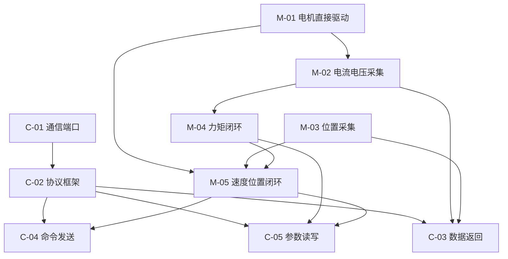

# 飞特 STS3215c018 舵机 — 硬件分析与功能实现（语雀版）

> **语雀使用说明**
> - 本文档已适配语雀 Markdown，可直接整篇复制或导入。
> - 导入方式：知识库 → **导入** → **Markdown** → 选择本文件。
> - 代码路径请在本地 IDE 中按路径打开。
>
> **语雀兼容说明：**
> - 子任务为标题 + 表格直接展开（勿用 HTML 折叠块）。
> - **页内跳转**：语雀标题锚点为导入后自动生成的随机 ID（如 `#kxm3a`），无法在外部 Markdown 里预写；请用 **大纲面板** 或导入后在语雀内 **插入链接 → 选择当前文档标题**。
>
> **产品：** 飞特 STS3215c018 舵机  
> **板卡型号：** 16999-PS26040802  
> **工程路径：** `servo_project/`  
> **编写日期：** 2026-06-24 · 文档版本：v3.2-语雀

[TOC]

---

## 1. 项目概述

飞特 STS3215c018 是一款带位置反馈的舵机，内部采用 **GD32F130** 主控 + **AS5600** 磁编码器 + **EG2104 H 桥** 驱动有刷电机。本文档包含：

1. **硬件分析** — 器件清单、引脚对应、系统框图  
2. **功能实现需求** — 电机类与通信类任务清单  
3. **任务总表与详情** — 可跟踪状态、跳转、验收的开发任务  

---

## 2. 硬件分析

### 2.1 原理图说明

> 原理图文件（本地）：`16999-PS26040802 原理图/16999-PS26040802 原理图.pdf`  
> 可在语雀中上传原理图 PDF 或截图，替换此处占位。

```text
  P1/P2(VIN) ──► 保护/滤波 ──► VCC ──► ME6119 LDO ──► 3V3 ──► GD32 + AS5600 + 运放
                    │                                        │
                    └──────────────► VC1 ──► EG2104×2 ──► H桥 ──► M+ / M-
                                                              │
                                                         RS1(0.01Ω) ──► GS8591 ──► PA3 ADC
```

### 2.2 主要器件

| 器件 | 型号 | 功能 |
|------|------|------|
| MCU | **GD32F130F8P6TR** | 主控，TSSOP-20，64KB Flash |
| 位置传感器 | **AS5600-ASOM** | 12-bit 磁旋转位置传感器，I2C 地址 0x36 |
| 栅极驱动 | **EG2104 × 2** | 半桥栅极驱动，组成 H 桥 |
| 运放 | **GS8591-TR** | 电流采样差分放大 |
| 稳压 | **ME6119C33M5G** | 3.3V LDO |
| 功率管 | B3202 × 2 | N 管半桥功率模块 |
| 采样电阻 | RS1 0.01Ω | 低端电流 shunt，约 1A → 10mV |

### 2.3 引脚功能对应表

| 器件 | MCU 引脚 | 连接对象 | 功能 / 复用 |
|------|----------|----------|-------------|
| GD32F130F8P6TR | PA1 | — | ADC_IN1 |
| GD32F130F8P6TR | PA2 | 串口 TX/RX | USART0_TX / RX（单线半双工通信） |
| GD32F130F8P6TR | PA3 | GS8591-TR OUT | 电流采样 ADC_IN3 |
| GD32F130F8P6TR | PA4 | VIN 分压网络 | 母线电压 ADC_IN4 |
| GD32F130F8P6TR | PA6 | EG2104 #SD | H 桥驱动使能（低电平关断） |
| GD32F130F8P6TR | PA7 | M+ 侧 EG2104 IN | TIMER2_CH1，正转 PWM |
| GD32F130F8P6TR | PA9 | AS5600 SCL | I2C1_SCL |
| GD32F130F8P6TR | PA10 | AS5600 SDA | I2C1_SDA |
| GD32F130F8P6TR | PA13 | 烧录器 SWDIO | SWD 调试 |
| GD32F130F8P6TR | PA14 | 烧录器 SWCLK | SWD 调试 |
| GD32F130F8P6TR | PB1 | M- 侧 EG2104 IN | TIMER2_CH3，反转 PWM |
| GD32F130F8P6TR | PF0 | 烧录器 SWDIO | SWDIO（与 PA13 同功能，按实际 PCB 走线确认） |
| GD32F130F8P6TR | BOOT0 | GND | 从 Flash 启动 |
| GD32F130F8P6TR | NRST | 复位/调试座 | 系统复位 |

**EG2104 驱动要点：**

| 动作 | 做法 |
|------|------|
| 正转 | PA7 输出 PWM，PB1 低 |
| 反转 | PB1 输出 PWM，PA7 低 |
| 关断 | PA6 #SD 拉低 |
| 使能 | PA6 #SD 拉高 |

**AS5600 要点：** I2C 400 kHz；角度寄存器 0x0E（12-bit，0~4095）；STATUS 0x0B bit5（MD）= 磁铁有效；DIR 接 GND → 顺时针角度增大。

---

## 3. 功能实现需求

### 3.1 需求清单

**电机类**

| 需求 | 任务编号 | 说明 |
|------|----------|------|
| 电机直接驱动 | M-01 | PA7/PB1 PWM + PA6 #SD，开环正反转 |
| 电流及母线电压数据采集 | M-02 | PA3 电流、PA4 母线电压 ADC |
| 位置传感器数据采集 | M-03 | PA9/PA10 I2C 读 AS5600 |
| 电机力矩闭环 | M-04 | 电流环 PI，输出 PWM |
| 电机速度位置闭环 | M-05 | 位置/速度环 + 模式管理 |

**通信类**

| 需求 | 任务编号 | 说明 |
|------|----------|------|
| 通信端口打通 | C-01 | PA2 半双工串口 |
| 通信协议框架 | C-02 | 帧格式、CRC、命令分发 |
| 电机数据返回 | C-03 | 状态上报（角度/电流/电压等） |
| 电机命令发送 | C-04 | 运动指令、急停 |
| 电机参数读取写入 | C-05 | PID、保护阈值在线调整 |

### 3.2 目标控制架构

```text
位置环 → 速度环 → 电流(力矩)环 → H 桥 PWM (PA7/PB1) + #SD (PA6)
         ↑              ↑
      AS5600          GS8591/PA3
```

---

## 4. 使用说明

### 如何更新任务状态

在 **§5 任务总表** 中，直接修改对应行的「状态」列。可选值见下表，**仅使用这五种**，便于筛选与统计。

| 状态 | 含义 |
|------|------|
| 未开始 | 尚未着手 |
| 准备中 | 方案/环境/依赖已就绪，即将开发 |
| 推进中 | 正在实现或联调 |
| 已完成 | 验收通过 |
| 优化中 | 功能可用，持续改进性能或鲁棒性 |

### 如何添加新任务

1. 在 **§5 任务总表** 新增一行（大类 / 任务 / 子任务 三选一填「层级」列）。
2. 编号规则：电机类 `M-xx` / `M-xx-y`；通信类 `C-xx` / `C-xx-y`。
3. 在 **§6 任务详情** 对应分类下，复制 **附录 A** 模板粘贴并填写。
4. **标题即锚点**：详情标题 `#### M-XX 任务名称` → 总表链接 `名称`（空格改 `-`）；语雀中输入 `` 可自动补全。
5. 子任务标题用 `##### M-XX-Y 名称`，放在父任务「子任务明细」小节下，总表同步加一行。
6. 更新 **§8 依赖关系** 与 **§9 推荐实施计划**（如有影响）。


### 4.2 语雀里如何跳转到某个任务（重要）

语雀 **不能跳到某一行**，只能跳到 **某个标题块**。手写 `[链接](#M-01-xxx)` 在导入后 **无效**，点击可能新开页面。

**推荐方式（无需手改链接）：**

1. 阅读时打开文档右侧 **「大纲」** 面板，点击 `M-02-1 ADC 时钟与 GPIO 初始化` 等标题即可跳转。
2. 文首 `[TOC]` 会生成可点击目录（部分语雀版本支持）。

**若要在总表里做可点击跳转（导入后操作一次）：**

1. 在 **阅读模式** 下，鼠标悬停目标标题左侧，点击 **#** 图标，复制锚点（形如 `#abcde`）。
2. 回到编辑模式，选中总表中的任务名 → **插入链接** → 粘贴该锚点。
3. 或：选中文字 → 插入链接 → **选择当前文档的标题**（语雀自动匹配，最省事）。

**编号即定位：** 总表「编号」列（如 `M-02-1`）与详情区标题一致，可用 `Ctrl+F` 搜索编号快速定位。

### 文档结构

```text
§1 项目概述        ← 产品说明
§2 硬件分析        ← 器件、引脚、框图
§3 功能实现需求    ← 需求清单与架构
§4 使用说明        ← 状态更新、添加任务
§5 任务总表        ← 大/小/子任务 + 状态 + 跳转
§6 任务详情        ← 目标、思路、代码、验收
§7~§11 架构与计划  ← 参考信息
附录 A/B           ← 模板与修订记录
```

---

## 5. 任务总表

> **快速跳转：** 请使用语雀右侧 **大纲面板**，或文首 `[TOC]` 目录（详见 §4.2）

| 层级 | 编号 | 任务名称 | 阶段 | 状态 |
|:----:|------|----------|:----:|:----:|
| 大类 | M | 电机类 | — | — |
| 任务 | M-01 | 电机直接驱动 | P0 | 未开始 |
| 子任务 | M-01-1 | 修正 board_config.h 引脚 | P0 | 未开始 |
| 子任务 | M-01-2 | 确认 PB1 定时器复用与 PWM 初始化 | P0 | 未开始 |
| 子任务 | M-01-3 | 实现 motor_init() | P0 | 未开始 |
| 子任务 | M-01-4 | 实现 motor_enable/disable | P0 | 未开始 |
| 子任务 | M-01-5 | 实现 motor_set_duty() | P0 | 未开始 |
| 子任务 | M-01-6 | 默认关断 + 加入 Keil 工程编译 | P0 | 未开始 |
| 任务 | M-02 | 电流及母线电压数据采集 | P1 | 未开始 |
| 子任务 | M-02-1 | ADC 时钟与 GPIO 初始化 | P1 | 未开始 |
| 子任务 | M-02-2 | ADC 校准与通道配置 | P1 | 未开始 |
| 子任务 | M-02-3 | 定时采样或 DMA 扫描 | P1 | 未开始 |
| 子任务 | M-02-4 | 电流换算公式实现 | P1 | 未开始 |
| 子任务 | M-02-5 | 母线电压换算公式实现 | P1 | 未开始 |
| 子任务 | M-02-6 | 软件滤波 | P1 | 未开始 |
| 子任务 | M-02-7 | 过流/欠压/过压保护与关断 | P1 | 未开始 |
| 任务 | M-03 | 位置传感器数据采集 | P1 | 未开始 |
| 子任务 | M-03-1 | I2C1 初始化 | P1 | 未开始 |
| 子任务 | M-03-2 | 读 STATUS 判断磁铁有效 | P1 | 未开始 |
| 子任务 | M-03-3 | 读 ANGLE 12-bit 角度 | P1 | 未开始 |
| 子任务 | M-03-4 | 角度 unwrap 处理跳变 | P1 | 未开始 |
| 子任务 | M-03-5 | 差分计算速度 | P1 | 未开始 |
| 子任务 | M-03-6 | 无磁铁安全处理 | P1 | 未开始 |
| 任务 | M-04 | 电机力矩闭环（电流环） | P4 | 未开始 |
| 子任务 | M-04-1 | 定义 i_target 接口 | P4 | 未开始 |
| 子任务 | M-04-2 | 实现电流 PI 控制器 | P4 | 未开始 |
| 子任务 | M-04-3 | 输出限幅与积分抗饱和 | P4 | 未开始 |
| 子任务 | M-04-4 | 控制周期与 ADC 同步 | P4 | 未开始 |
| 子任务 | M-04-5 | 与过流保护、#SD 联动 | P4 | 未开始 |
| 子任务 | M-04-6 | 力矩模式上层接口 | P4 | 未开始 |
| 任务 | M-05 | 电机速度位置闭环 | P3/P4 | 未开始 |
| 子任务 | M-05-1 | 角度误差计算（wrap） | P3 | 未开始 |
| 子任务 | M-05-2 | 位置 PID → speed/i target | P3 | 未开始 |
| 子任务 | M-05-3 | AS5600 差分得 speed_meas | P4 | 未开始 |
| 子任务 | M-05-4 | 速度 PID → i_target | P4 | 未开始 |
| 子任务 | M-05-5 | 模式管理（开环/力矩/速度/位置） | P3 | 未开始 |
| 子任务 | M-05-6 | 到位判定与堵转检测 | P4 | 未开始 |
| 子任务 | M-05-7 | 通信设置目标值接口 | P5 | 未开始 |
| 大类 | C | 通信类 | — | — |
| 任务 | C-01 | 通信端口打通 | P2 | 未开始 |
| 子任务 | C-01-1 | PA2 配置 USART0 AF 复用 | P2 | 未开始 |
| 子任务 | C-01-2 | 使能半双工模式 | P2 | 未开始 |
| 子任务 | C-01-3 | GPIO 开漏 + 外部上拉 | P2 | 未开始 |
| 子任务 | C-01-4 | 波特率 115200 8N1 配置 | P2 | 未开始 |
| 子任务 | C-01-5 | 字节收发与环形缓冲 | P2 | 未开始 |
| 子任务 | C-01-6 | 半双工时序与总线冲突避免 | P2 | 未开始 |
| 任务 | C-02 | 通信协议框架 | P2 | 未开始 |
| 子任务 | C-02-1 | 定义帧结构与命令枚举 | P2 | 未开始 |
| 子任务 | C-02-2 | 组帧、解帧、CRC 校验 | P2 | 未开始 |
| 子任务 | C-02-3 | 命令分发 proto_dispatch() | P2 | 未开始 |
| 子任务 | C-02-4 | 错误码定义 | P2 | 未开始 |
| 任务 | C-03 | 电机数据返回 | P5 | 未开始 |
| 子任务 | C-03-1 | 定义 motor_status_t 结构体 | P5 | 未开始 |
| 子任务 | C-03-2 | 控制环周期内更新快照 | P5 | 未开始 |
| 子任务 | C-03-3 | GET_STATUS → STATUS_REPORT | P5 | 未开始 |
| 子任务 | C-03-4 | 可选定时主动上报 | P5 | 未开始 |
| 任务 | C-04 | 电机命令发送 | P5 | 未开始 |
| 子任务 | C-04-1 | 解析 SET_TARGET 帧 | P5 | 未开始 |
| 子任务 | C-04-2 | 参数范围校验 | P5 | 未开始 |
| 子任务 | C-04-3 | 写入命令队列/共享目标变量 | P5 | 未开始 |
| 子任务 | C-04-4 | 控制环固定周期读取执行 | P5 | 未开始 |
| 子任务 | C-04-5 | 非法命令返回 NACK | P5 | 未开始 |
| 任务 | C-05 | 电机参数读取写入 | P5 | 未开始 |
| 子任务 | C-05-1 | RAM 参数表与默认值 | P5 | 未开始 |
| 子任务 | C-05-2 | GET_PARAM / SET_PARAM 实现 | P5 | 未开始 |
| 子任务 | C-05-3 | 范围检查与即时生效 | P5 | 未开始 |
| 子任务 | C-05-4 | 可选 Flash 持久化 SAVE_PARAM | P5 | 未开始 |
| 子任务 | C-05-5 | 与 PID / 保护模块绑定 | P5 | 未开始 |

**阶段说明：**

| 阶段 | 名称 | 里程碑 |
|------|------|--------|
| P0 | 基础驱动 | 电机可开环正反转 |
| P1 | 感知采集 | 电流、电压、角度可读 |
| P2 | 通信基础 | 串口双向通信 + 最小协议 |
| P3 | 单环伺服 | 位置环跟踪 |
| P4 | 完整伺服 | 电流环 + 速度环 |
| P5 | 产品化 | 完整通信、保护、参数管理 |

↑ 返回总表

---

## 6. 任务详情

### 电机类

---

#### M-01 电机直接驱动

| 字段 | 内容 |
|------|------|
| **任务目标** | 不依赖闭环，按占空比/方向直接驱动 H 桥，实现开环正反转与关断 |
| **实现思路** | 按 §2.3 引脚表：PA7=TIMER2_CH1（M+ PWM）、PB1=TIMER2_CH3（M- PWM）、PA6=#SD；约 20 kHz；正转 PA7 PWM/PB1 低，反转相反；上电 #SD 拉低关断 |
| **代码实现跳转** | 目标：`servo_project/User/board_config.h`（待建）、`servo_project/User/motor.c`（待建）、`servo_project/User/motor.h`（待建） · 参考例程：`GD32F130例程共32个/gpio_output/gpio_output/User/motor.c`（引脚需修正） |
| **遇到问题** | 例程引脚与原理图 §8.3 不一致（U3 IN、#SD 接反）；PB1 定时器复用通道待查数据手册 |
| **方案改进** | 以硬件说明为准重写 `board_config.h`；查 GD32F130 手册确认 PB1 的 TIMER 通道与 AF 编号后再初始化 PWM |
| **验收标准** | 给定固定 duty 可正转/反转/停止；#SD 拉低时 H 桥无输出；PWM 约 20 kHz，无异常发热 |
| **完成情况** | 未开始 — `servo_project` 尚未集成 motor 模块 |

**依赖：** 无（最底层，优先实施） · **硬件：** PA7→U2 IN；PB1→U3 IN；PA6→#SD

#### 子任务明细

##### M-01-1 修正 board_config.h 引脚

| 字段 | 内容 |
|------|------|
| 任务目标 | 引脚宏与原理图 §8.3 一致 |
| 实现思路 | 定义 `MOTOR_PWM_FWD_PIN`、`MOTOR_PWM_REV_PIN`、`MOTOR_SD_PIN` 及对应 TIMER/通道 |
| 代码实现 | `servo_project/User/board_config.h`（待建） |
| 遇到问题 | — |
| 方案改进 | — |
| 验收标准 | 宏定义与硬件说明一一对应 |
| 完成情况 | 未开始 |

##### M-01-2 确认 PB1 定时器复用与 PWM 初始化

| 字段 | 内容 |
|------|------|
| 任务目标 | 确定 PB1 的 TIMER 通道并完成 PWM 时基配置 |
| 实现思路 | 查数据手册 AF 表 → 选 TIMER → 配置 PSC/ARR 得 20 kHz |
| 代码实现 | `servo_project/User/motor.c`（待建） |
| 遇到问题 | PB1 复用关系未确认 |
| 方案改进 | — |
| 验收标准 | 示波器测 PB1/P A7 波形频率约 20 kHz |
| 完成情况 | 未开始 |

##### M-01-3 实现 motor_init()

| 字段 | 内容 |
|------|------|
| 任务目标 | 初始化 PWM 与 #SD GPIO |
| 实现思路 | RCU 时钟 → GPIO AF → TIMER PWM 模式 → 默认占空比 0 |
| 代码实现 | `servo_project/User/motor.c`（待建） |
| 遇到问题 | — |
| 方案改进 | — |
| 验收标准 | 初始化后两路 PWM 无输出、#SD 为低 |
| 完成情况 | 未开始 |

##### M-01-4 实现 motor_enable() / motor_disable()

| 字段 | 内容 |
|------|------|
| 任务目标 | 通过 #SD 控制 H 桥使能/关断 |
| 实现思路 | #SD 高电平使能，低电平关断；disable 时同步清零 PWM |
| 代码实现 | `servo_project/User/motor.c`（待建） |
| 遇到问题 | — |
| 方案改进 | — |
| 验收标准 | enable 后可输出 PWM；disable 后 H 桥无驱动 |
| 完成情况 | 未开始 |

##### M-01-5 实现 motor_set_duty()

| 字段 | 内容 |
|------|------|
| 任务目标 | 按符号设置正反转占空比 |
| 实现思路 | duty>0：PA7 PWM + PB1 低；duty<0：PB1 PWM + PA7 低；duty=0：全低 |
| 代码实现 | `servo_project/User/motor.c`（待建） |
| 遇到问题 | — |
| 方案改进 | — |
| 验收标准 | 正负 duty 对应正反转，幅值与占空比一致 |
| 完成情况 | 未开始 |

##### M-01-6 默认关断 + 加入 Keil 工程编译

| 字段 | 内容 |
|------|------|
| 任务目标 | 模块集成进 `servo_project` 且编译无错 |
| 实现思路 | 在 `template.uvprojx` 添加源文件；`main.c` 调用 `motor_init()` |
| 代码实现 | `servo_project/User/main.c`、`servo_project/project/template.uvprojx` |
| 遇到问题 | — |
| 方案改进 | — |
| 验收标准 | Keil 编译通过；上电电机不转 |
| 完成情况 | 未开始 |

↑ 总表 M-01

---

#### M-02 电流及母线电压数据采集

| 字段 | 内容 |
|------|------|
| **任务目标** | 周期性采样母线电流与 VIN 电压，供保护与闭环使用 |
| **实现思路** | PA3/PA4 配置为 ADC 模拟输入；规则通道扫描 + 定时触发或 DMA；原始值经标定公式转物理量；滑动平均滤波；超阈值调用 `motor_disable()` |
| **代码实现跳转** | 目标：`servo_project/User/adc_monitor.c`（待建）、`servo_project/User/adc_monitor.h`（待建） |
| **遇到问题** | 运放增益 R9/R10/R12/R13、分压比 R1/R4 尚未标定 |
| **方案改进** | 先用万用表实测 VIN 反推 K_div；空载/已知负载标定电流增益 G |
| **验收标准** | 稳定读取 `i_bus(A)`、`v_bus(V)`；VIN 与万用表误差可接受；过流可关断驱动 |
| **完成情况** | 未开始 |

**依赖：** 建议 M-01 完成后联调 · **硬件：** PA3←电流采样；PA4←VIN 分压

#### 子任务明细

##### M-02-1 ADC 时钟与 GPIO 初始化

| 字段 | 内容 |
|------|------|
| 任务目标 | PA3/PA4 模拟输入就绪 |
| 实现思路 | 使能 ADC/GPIO 时钟，配置为 analog 模式 |
| 代码实现 | `servo_project/User/adc_monitor.c`（待建） |
| 遇到问题 | — |
| 方案改进 | — |
| 验收标准 | ADC 可读到原始值 |
| 完成情况 | 未开始 |

##### M-02-2 ADC 校准与通道配置

| 字段 | 内容 |
|------|------|
| 任务目标 | CH3 电流、CH4 电压通道配置完成 |
| 实现思路 | 上电校准 → 规则组 2 通道 → 采样时间满足运放建立 |
| 代码实现 | `servo_project/User/adc_monitor.c`（待建） |
| 遇到问题 | — |
| 方案改进 | — |
| 验收标准 | 双通道交替采样正常 |
| 完成情况 | 未开始 |

##### M-02-3 定时采样或 DMA 扫描

| 字段 | 内容 |
|------|------|
| 任务目标 | 1~10 kHz 稳定采样 |
| 实现思路 | TIMER 触发 ADC + DMA 环形缓冲 |
| 代码实现 | `servo_project/User/adc_monitor.c`（待建） |
| 遇到问题 | — |
| 方案改进 | — |
| 验收标准 | 采样率稳定，CPU 占用可接受 |
| 完成情况 | 未开始 |

##### M-02-4 电流换算公式实现

| 字段 | 内容 |
|------|------|
| 任务目标 | ADC → 母线电流（A） |
| 实现思路 | `I = (V_adc - V_offset) / (G × 0.01)`，G 标定 |
| 代码实现 | `servo_project/User/adc_monitor.c`（待建） |
| 遇到问题 | G 未知 |
| 方案改进 | 见 M-02 方案改进 |
| 验收标准 | 与钳形表趋势一致 |
| 完成情况 | 未开始 |

##### M-02-5 母线电压换算公式实现

| 字段 | 内容 |
|------|------|
| 任务目标 | ADC → VIN（V） |
| 实现思路 | `VIN = adc_raw × 3.3 / 4096 × K_div` |
| 代码实现 | `servo_project/User/adc_monitor.c`（待建） |
| 遇到问题 | K_div 未知 |
| 方案改进 | 见 M-02 方案改进 |
| 验收标准 | 与万用表误差 <5% |
| 完成情况 | 未开始 |

##### M-02-6 软件滤波

| 字段 | 内容 |
|------|------|
| 任务目标 | 降低采样噪声 |
| 实现思路 | 滑动平均或一阶低通 |
| 代码实现 | `servo_project/User/adc_monitor.c`（待建） |
| 遇到问题 | — |
| 方案改进 | — |
| 验收标准 | 静态读数稳定，动态响应可接受 |
| 完成情况 | 未开始 |

##### M-02-7 过流/欠压/过压保护与关断

| 字段 | 内容 |
|------|------|
| 任务目标 | 异常时自动 `motor_disable()` |
| 实现思路 | 阈值比较 + 故障标志位 + 可选迟滞 |
| 代码实现 | `servo_project/User/adc_monitor.c`（待建） |
| 遇到问题 | — |
| 方案改进 | — |
| 验收标准 | 模拟过流/欠压可关断并置 fault |
| 完成情况 | 未开始 |

↑ 总表 M-02

---

#### M-03 位置传感器数据采集

| 字段 | 内容 |
|------|------|
| **任务目标** | 读取 AS5600 绝对角度，检测磁铁，计算速度 |
| **实现思路** | I2C1（PA9/PA10）读 STATUS/ANGLE 寄存器；12-bit 角度 unwrap；差分求速度；无磁铁禁止使能 |
| **代码实现跳转** | 目标：`servo_project/User/as5600.c`（待建）、`servo_project/User/as5600.h`（待建） · 参考：`GD32F130例程共32个/gpio_output/gpio_output/User/as5600.c` |
| **遇到问题** | `servo_project` 尚未集成 as5600 模块 |
| **方案改进** | 从例程移植并适配 I2C 引脚与错误处理 |
| **验收标准** | 角度连续 `raw×360/4096`°；无磁 `magnet_ok=false`；速度平滑方向正确 |
| **完成情况** | 未开始 |

**依赖：** 无（可与 M-02 并行） · **硬件：** PA9/PA10 I2C1 → AS5600（0x36）

#### 子任务明细

##### M-03-1 I2C1 初始化

| 字段 | 内容 |
|------|------|
| 任务目标 | I2C1 400 kHz 就绪 |
| 实现思路 | PA9 SCL、PA10 SDA，AF4，开漏上拉 |
| 代码实现 | `servo_project/User/as5600.c`（待建） |
| 遇到问题 | — |
| 方案改进 | — |
| 验收标准 | 可读写 AS5600 寄存器 |
| 完成情况 | 未开始 |

##### M-03-2 读 STATUS 判断磁铁有效

| 字段 | 内容 |
|------|------|
| 任务目标 | 检测 MD 位 |
| 实现思路 | 读 0x0B，检查 bit[5] |
| 代码实现 | `servo_project/User/as5600.c`（待建） |
| 遇到问题 | — |
| 方案改进 | — |
| 验收标准 | 有/无磁铁状态正确 |
| 完成情况 | 未开始 |

##### M-03-3 读 ANGLE 12-bit 角度

| 字段 | 内容 |
|------|------|
| 任务目标 | 读 0x0E 得 0~4095 |
| 实现思路 | 读 2 字节，取低 12 bit |
| 代码实现 | `servo_project/User/as5600.c`（待建） |
| 遇到问题 | — |
| 方案改进 | — |
| 验收标准 | 旋转时 raw 单调（除跳变点） |
| 完成情况 | 未开始 |

##### M-03-4 角度 unwrap 处理跳变

| 字段 | 内容 |
|------|------|
| 任务目标 | 多圈累计角度 |
| 实现思路 | 检测 ±2048 跳变累加/减 4096 |
| 代码实现 | `servo_project/User/as5600.c`（待建） |
| 遇到问题 | — |
| 方案改进 | — |
| 验收标准 | 连续旋转角度单调递增/递减 |
| 完成情况 | 未开始 |

##### M-03-5 差分计算速度

| 字段 | 内容 |
|------|------|
| 任务目标 | 估算角速度 |
| 实现思路 | `speed = Δangle / Δt`，可选低通 |
| 代码实现 | `servo_project/User/as5600.c`（待建） |
| 遇到问题 | — |
| 方案改进 | — |
| 验收标准 | 匀速时 speed 稳定，方向正确 |
| 完成情况 | 未开始 |

##### M-03-6 无磁铁安全处理

| 字段 | 内容 |
|------|------|
| 任务目标 | 无磁铁时不允许闭环 |
| 实现思路 | `magnet_ok==false` 时 disable + 置 fault |
| 代码实现 | `servo_project/User/as5600.c`（待建） |
| 遇到问题 | — |
| 方案改进 | — |
| 验收标准 | 移走磁铁后电机关断 |
| 完成情况 | 未开始 |

↑ 总表 M-03

---

#### M-04 电机力矩闭环（电流环）

| 字段 | 内容 |
|------|------|
| **任务目标** | 给定目标电流/力矩，PI 调节 PWM 占空比 |
| **实现思路** | 电流环最内环：PI 输出 duty；与 ADC 采样同步（5~10 kHz）；积分抗饱和；与过流保护联动 |
| **代码实现跳转** | 目标：`servo_project/User/current_loop.c`（待建）、`servo_project/User/pid.c`（待建） |
| **遇到问题** | — |
| **方案改进** | — |
| **验收标准** | 固定 i_target 稳态误差可接受；超限关断；可独立力矩模式 |
| **完成情况** | 未开始 |

**依赖：** M-01、M-02

#### 子任务明细

##### M-04-1 定义 i_target 接口

| 字段 | 内容 |
|------|------|
| 任务目标 | 统一力矩给定入口 |
| 实现思路 | float A 或归一化 -1.0~1.0 |
| 代码实现 | `servo_project/User/current_loop.h`（待建） |
| 遇到问题 | — |
| 方案改进 | — |
| 验收标准 | 接口文档清晰，可设目标 |
| 完成情况 | 未开始 |

##### M-04-2 实现电流 PI 控制器

| 字段 | 内容 |
|------|------|
| 任务目标 | error = i_target - i_meas → PI → duty |
| 实现思路 | 复用通用 `pid.c` 或独立 PI |
| 代码实现 | `servo_project/User/current_loop.c`（待建） |
| 遇到问题 | — |
| 方案改进 | — |
| 验收标准 | 阶跃响应收敛 |
| 完成情况 | 未开始 |

##### M-04-3 输出限幅与积分抗饱和

| 字段 | 内容 |
|------|------|
| 任务目标 | 防止积分 windup |
| 实现思路 | duty 限 ±max_duty；饱和时停积分 |
| 代码实现 | `servo_project/User/current_loop.c`（待建） |
| 遇到问题 | — |
| 方案改进 | — |
| 验收标准 | 大误差时不振荡发散 |
| 完成情况 | 未开始 |

##### M-04-4 控制周期与 ADC 同步

| 字段 | 内容 |
|------|------|
| 任务目标 | 环周期与采样对齐 |
| 实现思路 | ADC 完成中断或 DMA 半满触发 PI |
| 代码实现 | `servo_project/User/current_loop.c`（待建） |
| 遇到问题 | — |
| 方案改进 | — |
| 验收标准 | 周期抖动 <10% |
| 完成情况 | 未开始 |

##### M-04-5 与过流保护、#SD 联动

| 字段 | 内容 |
|------|------|
| 任务目标 | 故障时立即退出闭环 |
| 实现思路 | 读 fault_flags → disable + 清积分 |
| 代码实现 | `servo_project/User/current_loop.c`（待建） |
| 遇到问题 | — |
| 方案改进 | — |
| 验收标准 | 过流后 PI 状态复位 |
| 完成情况 | 未开始 |

##### M-04-6 力矩模式上层接口

| 字段 | 内容 |
|------|------|
| 任务目标 | 供 M-05 / C-04 调用 |
| 实现思路 | `servo_set_torque(float i_target)` |
| 代码实现 | `servo_project/User/servo_ctrl.c`（待建） |
| 遇到问题 | — |
| 方案改进 | — |
| 验收标准 | 模式切换正确 |
| 完成情况 | 未开始 |

↑ 总表 M-04

---

#### M-05 电机速度位置闭环

| 字段 | 内容 |
|------|------|
| **任务目标** | 位置/速度伺服，给定目标后稳定跟踪 |
| **实现思路** | 三环串联：位置环→速度环→电流环→PWM；P3 可先单层位置 PID 直出 duty；P4 补全速度环与电流环；模式管理 + 堵转检测 |
| **代码实现跳转** | 目标：`servo_project/User/servo_ctrl.c`（待建）、`servo_project/User/pid.c`（待建） · 参考：`GD32F130例程共32个/gpio_output/gpio_output/User/main.c`（仅单层位置 PID） |
| **遇到问题** | 例程为位置 PID 直出 PWM，缺速度环/电流环 |
| **方案改进** | 分阶段：P3 先移植单层位置环验证；P4 接入 M-04 电流环 |
| **验收标准** | 位置阶跃到位超调可接受；速度模式平稳；模式切换无冲击 |
| **完成情况** | 未开始 |

**依赖：** M-01、M-03（P3）；+ M-04（P4 完整三环）

#### 子任务明细

##### M-05-1 角度误差计算（wrap）

| 字段 | 内容 |
|------|------|
| 任务目标 | ±2048 内最短路径误差 |
| 实现思路 | `err = target - meas`，wrap 到 `servo_project/User/servo_ctrl.c`（待建） |
| 遇到问题 | — |
| 方案改进 | — |
| 验收标准 | 跨 0° 时走最短路径 |
| 完成情况 | 未开始 |

##### M-05-2 位置 PID → speed/i target

| 字段 | 内容 |
|------|------|
| 任务目标 | 外环位置 PID |
| 实现思路 | 输出 speed_target（有三环）或 duty（P3 简化） |
| 代码实现 | `servo_project/User/servo_ctrl.c`（待建） |
| 遇到问题 | — |
| 方案改进 | — |
| 验收标准 | 位置阶跃响应合格 |
| 完成情况 | 未开始 |

##### M-05-3 AS5600 差分得 speed_meas

| 字段 | 内容 |
|------|------|
| 任务目标 | 速度反馈 |
| 实现思路 | 复用 M-03-5 或环内再滤波 |
| 代码实现 | `servo_project/User/servo_ctrl.c`（待建） |
| 遇到问题 | — |
| 方案改进 | — |
| 验收标准 | 与 M-03 速度一致 |
| 完成情况 | 未开始 |

##### M-05-4 速度 PID → i_target

| 字段 | 内容 |
|------|------|
| 任务目标 | 中环速度 PID |
| 实现思路 | 输出 i_target 给 M-04 |
| 代码实现 | `servo_project/User/servo_ctrl.c`（待建） |
| 遇到问题 | — |
| 方案改进 | — |
| 验收标准 | 速度模式平稳 |
| 完成情况 | 未开始 |

##### M-05-5 模式管理

| 字段 | 内容 |
|------|------|
| 任务目标 | 开环/力矩/速度/位置切换 |
| 实现思路 | 状态机 + 切换时清积分/bumpless |
| 代码实现 | `servo_project/User/servo_ctrl.c`（待建） |
| 遇到问题 | — |
| 方案改进 | — |
| 验收标准 | 切换无异常冲击 |
| 完成情况 | 未开始 |

##### M-05-6 到位判定与堵转检测

| 字段 | 内容 |
|------|------|
| 任务目标 | 判定到位与堵转保护 |
| 实现思路 | |err|<阈值且 speed≈0；高电流+低 speed→堵转 |
| 代码实现 | `servo_project/User/servo_ctrl.c`（待建） |
| 遇到问题 | — |
| 方案改进 | — |
| 验收标准 | 堵转时关断并报警 |
| 完成情况 | 未开始 |

##### M-05-7 通信设置目标值接口

| 字段 | 内容 |
|------|------|
| 任务目标 | 供 C-04 写入目标 |
| 实现思路 | 共享变量 + 原子更新或队列 |
| 代码实现 | `servo_project/User/servo_ctrl.c`（待建） |
| 遇到问题 | — |
| 方案改进 | — |
| 验收标准 | 上位机改目标后环跟踪 |
| 完成情况 | 未开始 |

↑ 总表 M-05

---

### 通信类

**物理层：** PA2 → USART0 单线半双工 → P1 Pin1 + GND

---

#### C-01 通信端口打通

| 字段 | 内容 |
|------|------|
| **任务目标** | 建立 MCU 与上位机串口链路 |
| **实现思路** | PA2 配置 USART0 半双工；开漏+上拉；115200 8N1；环形缓冲收发；发完切接收 |
| **代码实现跳转** | 目标：`servo_project/User/comm_usart.c`（待建）、`servo_project/User/comm_usart.h`（待建） |
| **遇到问题** | PA2 到 P1 Pin1 走线建议对照原理图最终确认 |
| **方案改进** | — |
| **验收标准** | USB 转串口双向收发无误；长时间通信丢包率可接受 |
| **完成情况** | 未开始 |

**依赖：** 无（可与 P0/P1 并行）

#### 子任务明细

##### C-01-1 PA2 配置 USART0 AF 复用

| 字段 | 内容 |
|------|------|
| 任务目标 | PA2 为 USART0 TX 复用 |
| 实现思路 | GPIO AF 配置 |
| 代码实现 | `servo_project/User/comm_usart.c`（待建） |
| 遇到问题 | — |
| 方案改进 | — |
| 验收标准 | 引脚波形正确 |
| 完成情况 | 未开始 |

##### C-01-2 使能半双工模式

| 字段 | 内容 |
|------|------|
| 任务目标 | 单线收发 |
| 实现思路 | `usart_halfduplex_enable()` |
| 代码实现 | `servo_project/User/comm_usart.c`（待建） |
| 遇到问题 | — |
| 方案改进 | — |
| 验收标准 | 单线可收发 |
| 完成情况 | 未开始 |

##### C-01-3 GPIO 开漏 + 外部上拉

| 字段 | 内容 |
|------|------|
| 任务目标 | 总线物理层正确 |
| 实现思路 | OD 输出 + 4.7k 上拉 |
| 代码实现 | `servo_project/User/comm_usart.c`（待建） |
| 遇到问题 | — |
| 方案改进 | — |
| 验收标准 | 空闲高电平 |
| 完成情况 | 未开始 |

##### C-01-4 波特率 115200 8N1 配置

| 字段 | 内容 |
|------|------|
| 任务目标 | 通信参数就绪 |
| 实现思路 | 标准 8N1 初始化 |
| 代码实现 | `servo_project/User/comm_usart.c`（待建） |
| 遇到问题 | — |
| 方案改进 | — |
| 验收标准 | 波特率误差 <2% |
| 完成情况 | 未开始 |

##### C-01-5 字节收发与环形缓冲

| 字段 | 内容 |
|------|------|
| 任务目标 | 中断驱动收发 |
| 实现思路 | RX/TX ring buffer + IRQ |
| 代码实现 | `servo_project/User/comm_usart.c`（待建） |
| 遇到问题 | — |
| 方案改进 | — |
| 验收标准 | 连续收发不丢字节 |
| 完成情况 | 未开始 |

##### C-01-6 半双工时序与总线冲突避免

| 字段 | 内容 |
|------|------|
| 任务目标 | 发完再收 |
| 实现思路 | TX 完成回调切 RX；可选 DE 控制 |
| 代码实现 | `servo_project/User/comm_usart.c`（待建） |
| 遇到问题 | — |
| 方案改进 | — |
| 验收标准 | 无总线冲突 garble |
| 完成情况 | 未开始 |

↑ 总表 C-01

---

#### C-02 通信协议框架

| 字段 | 内容 |
|------|------|
| **任务目标** | 统一帧格式，支撑上报、命令、参数读写 |
| **实现思路** | 帧头 0xAA55 + 类型 + 命令码 + 长度 + Payload + CRC16；`proto_dispatch()` 分发 |
| **代码实现跳转** | 目标：`servo_project/User/proto.c`（待建）、`servo_project/User/proto.h`（待建） |
| **遇到问题** | — |
| **方案改进** | — |
| **验收标准** | 合法帧正确应答；非法帧 NACK |
| **完成情况** | 未开始 |

**建议命令码：** 0x01 GET_STATUS · 0x02 STATUS_REPORT · 0x10 SET_TARGET · 0x20 GET_PARAM · 0x21 SET_PARAM · 0x22 SAVE_PARAM · 0xFF NACK

**依赖：** C-01

#### 子任务明细

##### C-02-1 定义帧结构与命令枚举

| 字段 | 内容 |
|------|------|
| 任务目标 | 协议数据结构 |
| 实现思路 | struct + enum cmd |
| 代码实现 | `servo_project/User/proto.h`（待建） |
| 遇到问题 | — |
| 方案改进 | — |
| 验收标准 | 头文件可独立 include |
| 完成情况 | 未开始 |

##### C-02-2 组帧、解帧、CRC 校验

| 字段 | 内容 |
|------|------|
| 任务目标 | 编解码与校验 |
| 实现思路 | CRC16-Modbus 或 CCITT |
| 代码实现 | `servo_project/User/proto.c`（待建） |
| 遇到问题 | — |
| 方案改进 | — |
| 验收标准 | 单元测试向量通过 |
| 完成情况 | 未开始 |

##### C-02-3 命令分发 proto_dispatch()

| 字段 | 内容 |
|------|------|
| 任务目标 | 按命令码路由 |
| 实现思路 | switch/case 或函数表 |
| 代码实现 | `servo_project/User/proto.c`（待建） |
| 遇到问题 | — |
| 方案改进 | — |
| 验收标准 | 各命令码可路由 |
| 完成情况 | 未开始 |

##### C-02-4 错误码定义

| 字段 | 内容 |
|------|------|
| 任务目标 | 统一错误语义 |
| 实现思路 | 校验失败/越界/未使能等 |
| 代码实现 | `servo_project/User/proto.h`（待建） |
| 遇到问题 | — |
| 方案改进 | — |
| 验收标准 | NACK 带错误码 |
| 完成情况 | 未开始 |

↑ 总表 C-02

---

#### C-03 电机数据返回

| 字段 | 内容 |
|------|------|
| **任务目标** | 周期性或按需上报电机运行状态 |
| **实现思路** | `motor_status_t` 快照；控制环内更新；响应 GET_STATUS；可选 10~100 Hz 主动上报 |
| **代码实现跳转** | 目标：`servo_project/User/proto.c`（待建） |
| **遇到问题** | — |
| **方案改进** | — |
| **验收标准** | 上位机数据与本地一致；fault 位正确 |
| **完成情况** | 未开始 |

**上报字段：** angle_raw · speed · i_bus · v_bus · duty · mode · fault_flags · magnet_ok

**依赖：** C-01、C-02、M-02、M-03

#### 子任务明细

##### C-03-1 定义 motor_status_t 结构体

| 字段 | 内容 |
|------|------|
| 任务目标 | 统一状态快照 |
| 实现思路 |  packed struct 与协议对齐 |
| 代码实现 | `servo_project/User/proto.h`（待建） |
| 遇到问题 | — |
| 方案改进 | — |
| 验收标准 |  sizeof 与协议一致 |
| 完成情况 | 未开始 |

##### C-03-2 控制环周期内更新快照

| 字段 | 内容 |
|------|------|
| 任务目标 | 数据实时性 |
| 实现思路 | 环末尾 memcpy 到 status |
| 代码实现 | `servo_project/User/servo_ctrl.c`（待建） |
| 遇到问题 | — |
| 方案改进 | — |
| 验收标准 | 快照与当前值一致 |
| 完成情况 | 未开始 |

##### C-03-3 GET_STATUS → STATUS_REPORT

| 字段 | 内容 |
|------|------|
| 任务目标 | 按需查询 |
| 实现思路 | dispatch 0x01 → 组 0x02 帧 |
| 代码实现 | `servo_project/User/proto.c`（待建） |
| 遇到问题 | — |
| 方案改进 | — |
| 验收标准 | 上位机查询有正确回复 |
| 完成情况 | 未开始 |

##### C-03-4 可选定时主动上报

| 字段 | 内容 |
|------|------|
| 任务目标 | 周期性推送 |
| 实现思路 | SysTick 或 TIMER 按 report_period_ms |
| 代码实现 | `servo_project/User/proto.c`（待建） |
| 遇到问题 | — |
| 方案改进 | — |
| 验收标准 | 频率可配置 |
| 完成情况 | 未开始 |

↑ 总表 C-03

---

#### C-04 电机命令发送

| 字段 | 内容 |
|------|------|
| **任务目标** | 上位机下发运动与模式指令 |
| **实现思路** | 解析 SET_TARGET：使能/目标位置/速度/电流/开环 duty/急停；校验范围；写入共享目标；环内执行 |
| **代码实现跳转** | 目标：`servo_project/User/proto.c`（待建）、`servo_project/User/servo_ctrl.c`（待建） |
| **遇到问题** | — |
| **方案改进** | — |
| **验收标准** | 位置指令跟踪；急停立即关断；越界拒绝 |
| **完成情况** | 未开始 |

**依赖：** C-01、C-02、M-01、M-05

#### 子任务明细

##### C-04-1 解析 SET_TARGET 帧

| 字段 | 内容 |
|------|------|
| 任务目标 | 解包运动命令 |
| 实现思路 | 按 mode 解析 payload |
| 代码实现 | `servo_project/User/proto.c`（待建） |
| 遇到问题 | — |
| 方案改进 | — |
| 验收标准 | 各 mode 解析正确 |
| 完成情况 | 未开始 |

##### C-04-2 参数范围校验

| 字段 | 内容 |
|------|------|
| 任务目标 | 拒绝非法值 |
| 实现思路 | 角度/duty/电流上下限 |
| 代码实现 | `servo_project/User/proto.c`（待建） |
| 遇到问题 | — |
| 方案改进 | — |
| 验收标准 | 越界返回 NACK |
| 完成情况 | 未开始 |

##### C-04-3 写入命令队列/共享目标变量

| 字段 | 内容 |
|------|------|
| 任务目标 | 线程安全传递 |
| 实现思路 | volatile 目标 + 新命令标志 |
| 代码实现 | `servo_project/User/servo_ctrl.c`（待建） |
| 遇到问题 | — |
| 方案改进 | — |
| 验收标准 | 命令不丢失 |
| 完成情况 | 未开始 |

##### C-04-4 控制环固定周期读取执行

| 字段 | 内容 |
|------|------|
| 任务目标 | 环内应用命令 |
| 实现思路 | 每周期检查 cmd_pending |
| 代码实现 | `servo_project/User/servo_ctrl.c`（待建） |
| 遇到问题 | — |
| 方案改进 | — |
| 验收标准 | 延迟 ≤1 控制周期 |
| 完成情况 | 未开始 |

##### C-04-5 非法命令返回 NACK

| 字段 | 内容 |
|------|------|
| 任务目标 | 错误反馈 |
| 实现思路 | 0xFF + err_code |
| 代码实现 | `servo_project/User/proto.c`（待建） |
| 遇到问题 | — |
| 方案改进 | — |
| 验收标准 | 非法帧有 NACK |
| 完成情况 | 未开始 |

↑ 总表 C-04

---

#### C-05 电机参数读取写入

| 字段 | 内容 |
|------|------|
| **任务目标** | 在线调整 PID、限幅、保护阈值等 |
| **实现思路** | RAM 参数表 + GET/SET_PARAM；范围检查即时生效；可选 Flash SAVE_PARAM |
| **代码实现跳转** | 目标：`servo_project/User/param.c`（待建）、`servo_project/User/param.h`（待建） |
| **遇到问题** | — |
| **方案改进** | — |
| **验收标准** | 读写一致；改 PID 有效果；Flash 重启保留（若实现） |
| **完成情况** | 未开始 |

**参数 ID：** 0x01 位置 PID · 0x02 速度 PID · 0x03 电流 PI · 0x10 max_duty · 0x11 i_max · 0x12 v_min/v_max · 0x20 report_period_ms

**依赖：** C-01、C-02；被调 M-04、M-05

#### 子任务明细

##### C-05-1 RAM 参数表与默认值

| 字段 | 内容 |
|------|------|
| 任务目标 | 参数存储 |
| 实现思路 | struct + 默认数组 |
| 代码实现 | `servo_project/User/param.c`（待建） |
| 遇到问题 | — |
| 方案改进 | — |
| 验收标准 | 上电默认值合理 |
| 完成情况 | 未开始 |

##### C-05-2 GET_PARAM / SET_PARAM 实现

| 字段 | 内容 |
|------|------|
| 任务目标 | 协议读写 |
| 实现思路 | 按 param_id 读写 |
| 代码实现 | `servo_project/User/param.c`（待建） |
| 遇到问题 | — |
| 方案改进 | — |
| 验收标准 | 读回与写入一致 |
| 完成情况 | 未开始 |

##### C-05-3 范围检查与即时生效

| 字段 | 内容 |
|------|------|
| 任务目标 | 安全写入 |
| 实现思路 | clamp + 同步到 PID 结构 |
| 代码实现 | `servo_project/User/param.c`（待建） |
| 遇到问题 | — |
| 方案改进 | — |
| 验收标准 | 越界拒绝；合法立即生效 |
| 完成情况 | 未开始 |

##### C-05-4 可选 Flash 持久化 SAVE_PARAM

| 字段 | 内容 |
|------|------|
| 任务目标 | 掉电保存 |
| 实现思路 | Flash 末尾页擦写 |
| 代码实现 | `servo_project/User/param.c`（待建） |
| 遇到问题 | — |
| 方案改进 | — |
| 验收标准 | 重启参数保留 |
| 完成情况 | 未开始 |

##### C-05-5 与 PID / 保护模块绑定

| 字段 | 内容 |
|------|------|
| 任务目标 | 参数驱动控制 |
| 实现思路 | setter 更新 pid/protect 结构 |
| 代码实现 | `servo_project/User/param.c`（待建） |
| 遇到问题 | — |
| 方案改进 | — |
| 验收标准 | 改 kp 后响应变化 |
| 完成情况 | 未开始 |

↑ 总表 C-05

---

## 7. 总体架构

```text
┌─────────────────────────────────────────────────────────┐
│  通信层（PA2 单线半双工 USART）                            │
│  命令下发 │ 状态上报 │ 参数读写                            │
└──────────────────────────┬──────────────────────────────┘
                           │
┌──────────────────────────▼──────────────────────────────┐
│  应用层：模式管理（开环 / 位置 / 速度 / 力矩）              │
└──────────────────────────┬──────────────────────────────┘
                           │
        ┌──────────────────┼──────────────────┐
        ▼                  ▼                  ▼
   位置环 PID          速度环 PID          电流环 PI
        │                  │                  │
        └──────────────────┴──────────────────┘
                           ▼
                    PWM 输出 + #SD 使能
                           │
        ┌──────────────────┼──────────────────┐
        ▼                  ▼                  ▼
     AS5600              ADC PA3            ADC PA4
     (I2C)               电流               母线电压
```

**目标控制环：** 位置环 → 速度环 → 电流(力矩)环 → H 桥 PWM

---

## 8. 依赖关系



---

## 9. 推荐实施计划

| 顺序 | 阶段 | 任务 | 交付物 |
|------|------|------|--------|
| 1 | P0 | M-01 | 电机开环正反转 |
| 2 | P1 | M-02 + M-03 | ADC/AS5600 驱动，调试打印 |
| 3 | P2 | C-01 + C-02 | 串口最小 echo / 读角度命令 |
| 4 | P3 | M-05（单层位置环） | 位置跟踪 demo |
| 5 | P4 | M-04 + M-05（三环） | 力矩/速度/位置模式 |
| 6 | P5 | C-03 + C-04 + C-05 | 完整上位机联调 |

---

## 10. 建议软件目录结构

```text
servo_project/User/
├── board_config.h      # 引脚定义          [M-01]
├── motor.c/h           # H 桥 PWM + #SD    [M-01]
├── adc_monitor.c/h     # PA3/PA4 采样      [M-02]
├── as5600.c/h          # 位置/速度         [M-03]
├── current_loop.c/h    # 电流 PI           [M-04]
├── servo_ctrl.c/h      # 位置/速度环       [M-05]
├── pid.c/h             # 通用 PID
├── comm_usart.c/h      # 半双工 USART      [C-01]
├── proto.c/h           # 帧解析/组包       [C-02~C-04]
├── param.c/h           # 参数表 + Flash    [C-05]
├── systick.c/h
├── gd32f1x0_it.c/h
└── main.c
```

---

## 11. 当前工程状态（2026-06-24）

| 任务 | 例程 gpio_output | servo_project |
|------|------------------|---------------|
| M-01 | 有（引脚错误） | 无 |
| M-02 | 无 | 无 |
| M-03 | 有 | 无 |
| M-04 | 无 | 无 |
| M-05 | 仅位置→duty | 无 |
| C-01~C-05 | 无 | 无 |

**已知阻塞项：**

1. PA2 串口外设为 USART0（见 §2.3），固件需核对 GD32F130 数据手册 AF 复用
2. `board_config.h` 引脚定义尚未按 §2.3 集成到 `servo_project`
3. 电流增益、VIN 分压比未标定
4. PB1/P A7 的 TIMER2 通道配置需与原理图一致

---

## 附录 A · 任务详情模板（复制用）

```markdown
#### X-XX 任务名称

| 字段 | 内容 |
|------|------|
| **任务目标** | |
| **实现思路** | |
| **代码实现跳转** | `servo_project/User/文件.c` |
| **遇到问题** | — |
| **方案改进** | — |
| **验收标准** | |
| **完成情况** | 未开始 |

#### 子任务明细

##### X-XX-1 子任务名称

| 字段 | 内容 |
|------|------|
| 任务目标 | |
| 实现思路 | |
| 代码实现 | |
| 遇到问题 | — |
| 方案改进 | — |
| 验收标准 | |
| 完成情况 | 未开始 |


```

**总表新增行模板：**

```markdown
| 任务 | X-XX | 任务名称 | P? | 未开始 |
| 子任务 | X-XX-1 | 子任务名称 | P? | 未开始 |
```

---

## 附录 B · 修订记录

| 日期 | 版本 | 说明 |
|------|------|------|
| 2026-06-23 | v1.0 | 初版，由功能需求拆解整理 |
| 2026-06-24 | v2.0 | 重构：任务总表（大/小/子任务+状态+跳转）、统一详情模板、附录模板 |
| 2026-06-24 | v2.0-语雀 | 语雀适配：去 HTML 锚点、代码路径改行内代码、[TOC]、标题锚点跳转 |
| 2026-06-24 | v3.0-语雀 | 整合飞特 STS3215c018 硬件分析、引脚表、功能需求与任务拆解 |
| 2026-06-24 | v3.1-语雀 | 移除 `<details>` 折叠块，子任务改为标题+表格直接展开（修复语雀渲染） |
| 2026-06-24 | v3.2-语雀 | 移除手写锚点链接，改用语雀大纲/TOC 导航（修复新开页问题） |
